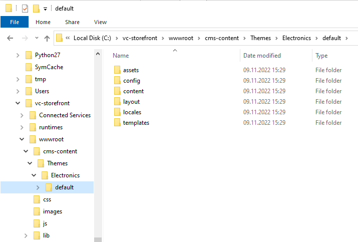

# Quick Start on Windows
This section will quickly guide you through simple Storefront setup based on Windows environment.

## Prerequisites
Prior to installing Storefront, you will need to:

- Install and launch CV Platform's latest version, *vc-platform 3.x*. You can either deploy it [on Windows](https://docs.virtocommerce.org/new/dev_docs/Getting-Started/Installation-Guide/Installing-on-Windows/02-installation-windows-on-premises-precompiled-binaries/) or [on Linux](https://github.com/VirtoCommerce/vc-platform/blob/master/docs/getting-started/deploy-from-precompiled-binaries-linux.md).
    
-   Install the Experience API module (refer to [this guide](https://docs.virtocommerce.org/new/dev_docs/GraphQL-Storefront-API-Reference-xAPI/getting-started/) to get started)
    
-   Install the [Profile Experience API](https://github.com/VirtoCommerce/vc-module-profile-experience-api) module

## Installing Storefront with Precompiled Version
To install Storefront:

- Download the [latest release](https://github.com/VirtoCommerce/vc-storefront/releases/latest) and unpack it to a local folder, e.g., `c:\vc-storefront`
    
- Open the `appsettings.json` file in a text editor
    
- In the `Endpoint` section, supply the correct path and credentials for the Virto Commerce Platform in the `Url`, `UserName`, and `Password` fields:
    
```json
...
 "Endpoint": {
     "Url": "https://localhost:5001",
     "UserName": "admin",
     "Password": "store",
```

## Installing vc-theme-b2b-vue from Bundle
To install the B2B Vue theme:

- Download the [latest theme release](https://github.com/VirtoCommerce/vc-theme-b2b-vue/releases) and unpack the `vc-theme-b2b-vue-x.xx.x.zip` package containing the theme to `{storefront path}\wwwroot\cms-content\themes\{store-name}`, e.g.:



## Launching Storefront

In order to launch the Storefront app, run this command:

```
dotnet VirtoCommerce.Storefront.dll 
```

## Known Issues

### Failed to Bind to Address http://127.0.0.1:5000: Address Already in Use Exception
This occurs when no ports are specified, which makes Kestrel bind the connection to http://localhost:5000 and https://localhost:5001. These ports might be already used by the platform application. To resolve this, use different ports for the Storefront application: 

```
dotnet VirtoCommerce.Storefront.dll --urls https://localhost:5005
```

### Forward Scheme for Linux and Non-IIS Reverse Proxies

Apps that call `UseHttpsRedirection` and `UseHsts` put a site into an infinite loop if deployed to an Azure Linux App Service, Azure Linux virtual machine (VM), Linux container, or behind any other reverse proxy besides IIS. The TLS is terminated by the reverse proxy, without Kestrel being aware of the correct request scheme. OAuth and OIDC also fail in this configuration because they generate incorrect redirects.

`UseIISIntegration` adds and configures Forwarded Headers Middleware when running behind IIS; however, there is no matching automatic configuration for Linux (Apache or Nginx integration).

To forward the scheme from the proxy in non-IIS scenarios, set the `ASPNETCORE_FORWARDEDHEADERS_ENABLED` environment variable to true.

For more details on how it works, see the relevant [guide](https://docs.microsoft.com/en-us/aspnet/core/host-and-deploy/proxy-load-balancer?view=aspnetcore-5.0#forward-the-scheme-for-linux-and-non-iis-reverse-proxies) by Microsoft.
