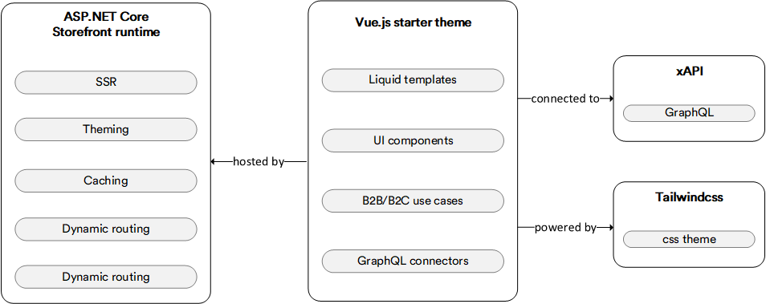

# Storefront Dev Documentation

**xStorerfont** is Virto Commerce’s proprietary framework that enables building custom storefronts (customer facing online stores) for the solutions based on the VC platform. Basically, it is your ultimate starting point for new projects. It strives to include up-to-date best practices and solutions that we consider ESSENTIAL for most projects we build, and also showcases the opportunities and features when building storefronts.

Not only is it a real-world solution that implements practical business use cases; it is also a good starting point for your storefront that you can customize through direct code modifications.

The **xStorefront** framework comes with two out-of-the-box projects: [**Vue.js Starter Theme**](https://github.com/VirtoCommerce/vc-theme-b2b-vue)  and [**ASP.NET Core Storefront Runtime**](https://github.com/VirtoCommerce/vc-storefront).

-   [**vc-storefront**](https://github.com/VirtoCommerce/vc-storefront) **(**[**ASP.NET**](http://ASP.NET) **Core Storefront runtime)** is a functionally sufficient and production-ready theme that is an ultimate starting point for all new themes to build custom storefront solutions upon. It includes all best practices we deem appropriate for most projects and showcases the possible features when building a theme. It can be customized via direct theme code modification and contains a set of specific commerce components that help accelerate your development process. This theme is styled using the [Tailwind CSS](https://tailwindcss.com/) utility library.
    
-   [**vc-theme-b2b-vue**](https://github.com/VirtoCommerce/vc-theme-b2b-vue) **(Vue.js starter theme)** represents the host environment (runtime) for storefront themes and provides SSR (Server Side Rendering) along with other options, such as dynamic routing and security concerns, e.g., user session, authentication, and authorization. It is designed as a project not intended to be customized and can be used as a binary application.

The **xStorefront** framework provides you with the following advantages:

- As an ultimate initial point, it can boost the performance of building new custom storefront projects, and includes everything you need to create a successful solution.
    
- Out-of-the-box theme engine that covers the most frequent B2C and B2B cases typical for the ecommerce domain. Most of such use cases can be reused as is, with just a few changes.
    
- The powerful front end is integrated into the VC Ecommerce Platform, with no special knowledge of how the VC Platform works required.
    
- Ready-made clean architecture that protects you from unwieldy architecture decisions and mitigates the developer requirements.
    
-  The flexible customization model based on the direct code modification enables changing everything without any complex extension layers. There are absolutely no limitations in terms of UI customization. As mentioned above, it is a starting point for building storefronts, a boilerplate for custom solutions, the code of which may be easily changed.
    
- Modern web development stack, including the [Vue.js 3.0](https://vuejs.org/) design principles, separation of logical concerns via [composition API](https://v3.vuejs.org/api/composition-api.html), eCommerce semantic component design system, and [GraphQL](https://graphql.org/) to retrieve data without under or over fetching.

