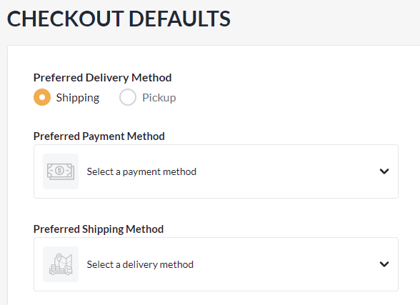

# Checkout defaults

To simplify the checkout process, the users can preset the checkout defaults. This way, users do not have to specify them every time they check out. 

These include:

* Preferred delivery method (shipping or pickup).
* Preferred payment method (bank card or manual).
* Preferred shipping method (air or ground).

