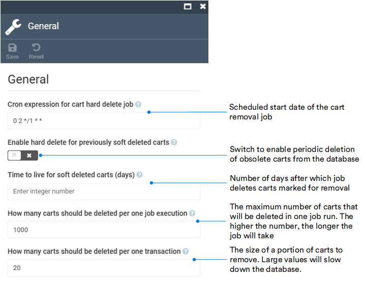

# Settings

Although the Cart module does not have a UI, you can configure its general settings. 

To open Cart module general settings:

1. Click **Settings** in the main menu.
1. In the search field of the next blade, type **Cart** to find the settings related to the module.
1. Click **General**.
1. Configure the following settings:

    

1. Click **Save** in the toolbar to save the changes.

The settings have been saved.

