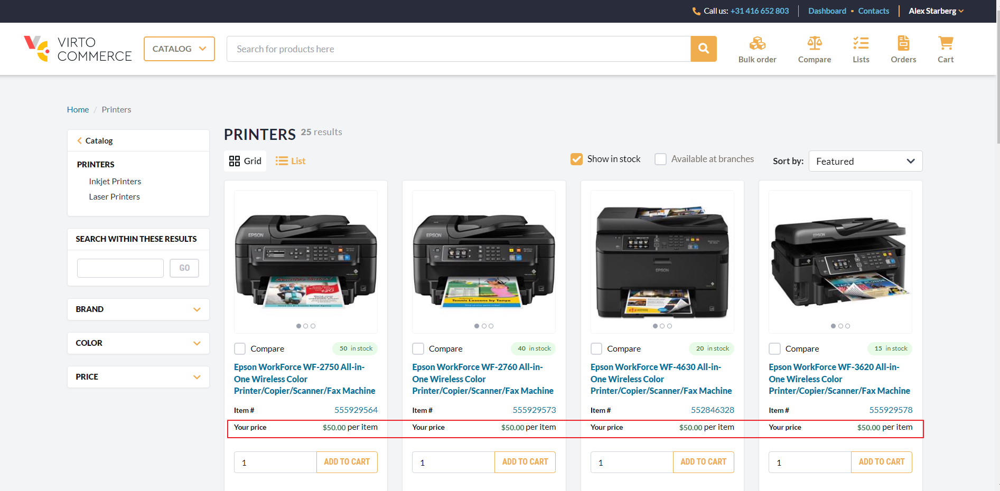

# How to Enable Special Prices for Specific Users
This guide will explain you how to show and apply specific prices to the users of your choice. In our example, we will configure Virto Platform in such a way that the store will display a disconted price for loyal customers.

## Creating User Group and Adding Contacts
Let's assume you have an item you are willing to sell at a discounted price to your loyal customers, as a reward to their loyalty. To make it happen, you need to first create a user group, as described [here](../user-groups.md#creating-new-user-group), and add all contacts of those loyal customers to this group. If any of those people are not yet registered in your system, you can easily create as many contacts as you need.

In our example, we created a group called *VIP* and assigned various contacts to it, including one named Alex Starberg, who will be our loyal customer in the example:

## Assigning User Group to Price List
By default, the items we will be selling to loyal customers with a discount (printers in our example) has the same price for everyone who visits the store:

To enable the special price for the VIP customers, you should do the following:

Create a new price list, as described [here](../../pricing/creating-new-price-list.md), and [provide special prices](../../pricing/adding-products-to-new-price-list.md) to the products in question. In our example, we want to offer printers at $50 per item:

Create a dedicated price list assignment, as described [here](../../pricing/adding-new-assignment.md) and attach the price list you just created to it:

Finally, assign the group in question through the ***User group contains...*** menu:

Now, if anyone who is not included into our *VIP* group visits our store, they will see the regular price for the item in question, as shown above. However, once Alex Starberg, our loyal customer, logs into the store, he will get his discount:

