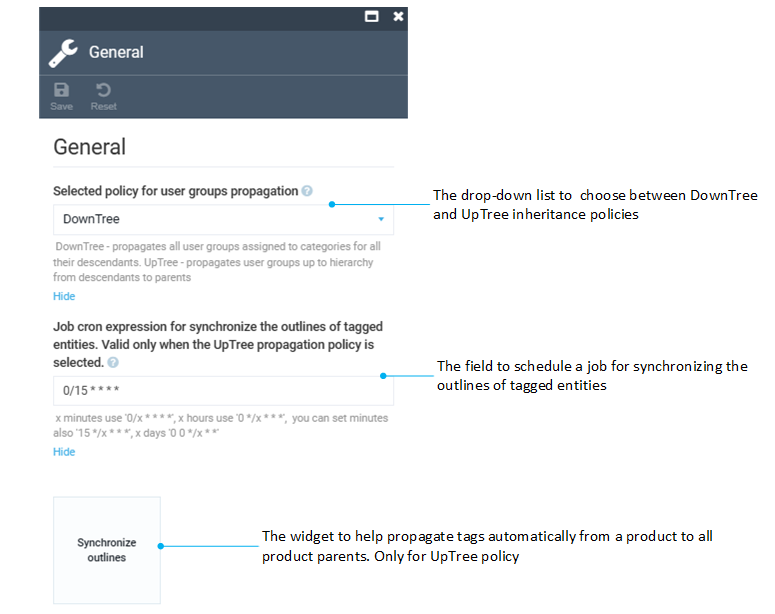

# Settings

To manage personalization settings:

1. Click **Settings** in the main menu.
1. In the next blade, type **Personalization** to find settings related to the module.
1. Select **General**.
1. In the next blade, configure the settings:

	

1. Click **Save** in the toolbar to save the changes.

The settings have been saved.