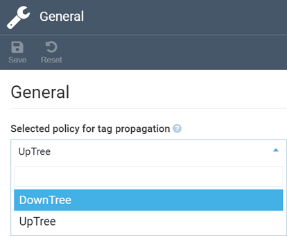
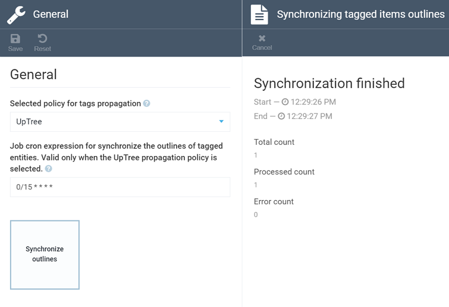

# Settings

To open the Personalization module settongs, navigate to ***Settings -> Personalization -> General***.

## Toggling Tag Propagation Policies
The first setting section allows you to switch the tag propagation policy from ***DownTree*** to ***UpTree***, and vice versa:

Once you've switched the plicy, click ***Save*** and restart the app, so that your changes may come into effect.

## Synchronizing Outlines

The ***Synchronize outlines*** feature helps propagate tags automatically from a product to all product parents. You can provide a cron expression to schedule the sync job, and view this job stats by clicking the respective widget:

!!! note
	The ***Synchronize outlines*** feature works for the ***UpTree*** policy only.