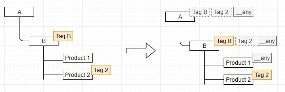
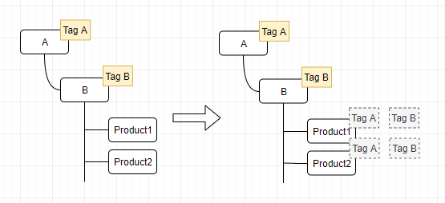

# Tag Inheritance and Propagation

The tags you assign to catalog objects have an intrinsic *inheritance* feature, which is 'double-sword', i.e.:

+ With the **UpTree** policy, you can propagate your tags from children to parents, up in the hierarchy:

    
+ With the **DownTree** policy, children inherit the tags from parents, down the hierarchy:

For instance, using the UpTree policy, a category will inherit tags from its products, while with the DownTree policy, every product will get the same tags as its category.

{: width="25"} [Switching tag propagation policies, Managing other personalization settings](settings.md).

