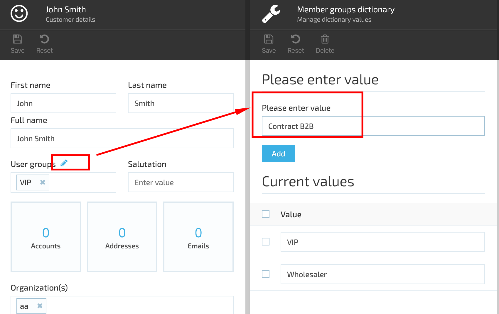
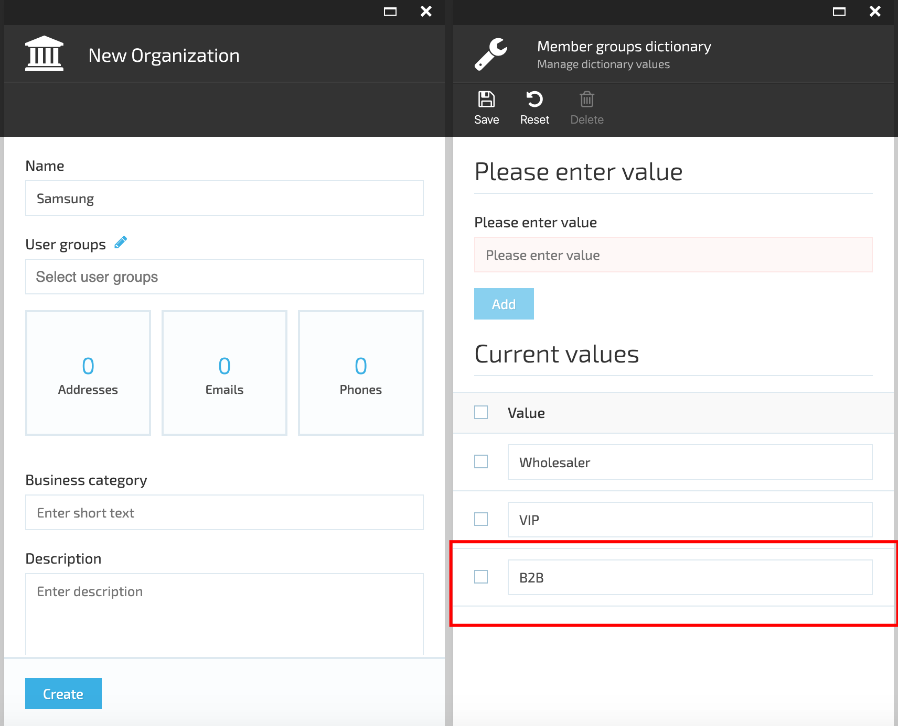
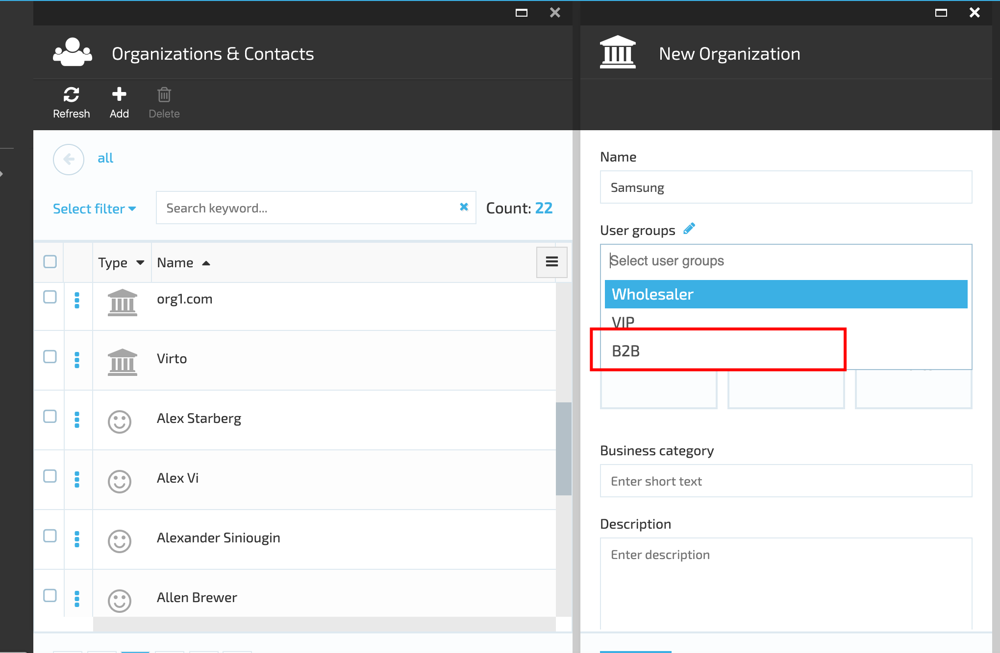
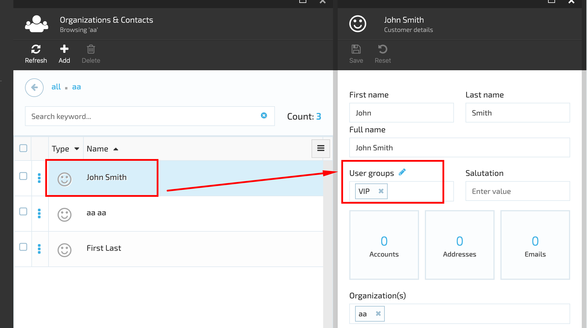
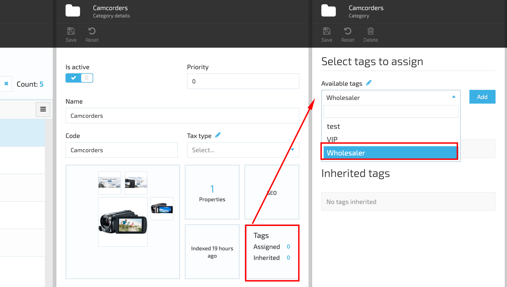
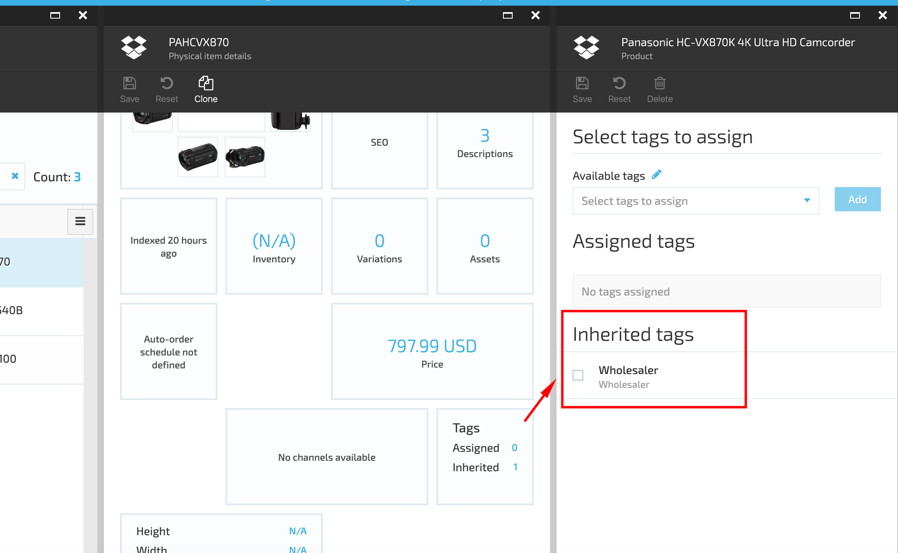
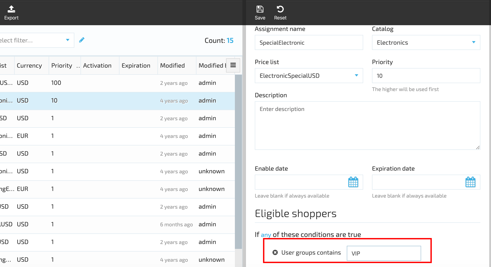
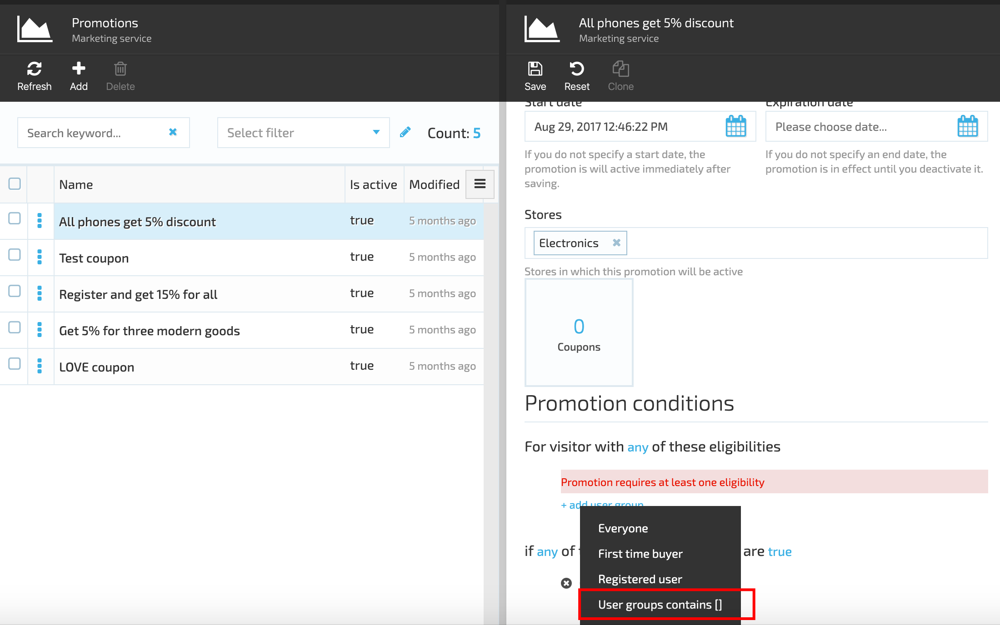
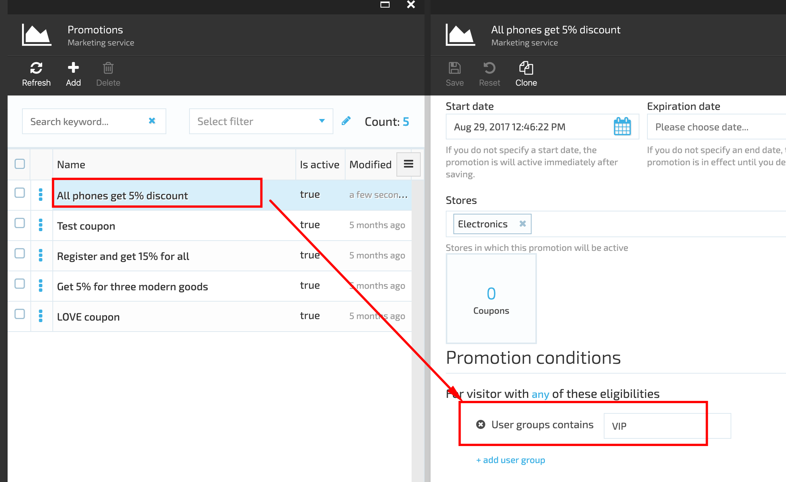

# Working with User Groups
The ***User Group*** feature allows you to include various individual contacts, vendors, and companies into a single group. This will then enable you to assign such user group to a specific product category, price list assignment, or marketing promotion.

## Creating New User Group

1. Go to More->Contacts module-> select a user from the list and open user's details;
1. Click the 'Edit' of the User Groups;

1. In the opened 'Member groups dictionary' enter the new User Group name and click the 'Add' button;
1. Save the new user group;

1. The new user group is now available for selection.

## Assigning User Group to Contact

1. Go to More->Contacts module and select a Contact from the list;
1. Open Contact's details;
1. Select the User Group from the drop down;
1. Save the changes;
1. The selected User Group will be assigned to the Contact.

## Assigning User Group to Product Category

1. Go to More->Catalog Module->select a Product Category and click 'Manage';
1. On Category details blade select the 'Tags' widget;
1. Under 'Available tags' select the tag to assign to the Category;
1. Click 'Add';
1. Save the changes;
1. Open the Category;
1. Select a product and click the 'Tags' widget;
1. The tag assigned to the Category will be displayed under the 'Inherited tag'. All Category products will inherit the tag assigned to the Category in case of DownTree propagation.

## Assigning User Group to Price List Assignment

1. Go to More->Pricing Module->select a Price list Assignment and open the Price list Assignments details;
1. Under 'Add condition' select 'Shopper profile' and then 'User Group contain';
1. Enter the User Group name into the corresponding field;
1. Save the changes.

## Assigning User Group to Marketing Promotion

1. Go to More-Marketing module->Promotions;
1. Select a Promotion and open the promotion details blade;
1. Under 'Add user group' select 'User group contains';
1. Enter the user group name into the corresponding field;
1. Save the changes;
1. The assigned user group will be applied to the selected promotion.

!!! warning
	Make sure to rebuild the search indexes for categories and products after the tagging process.

Rebuild indexes

 

