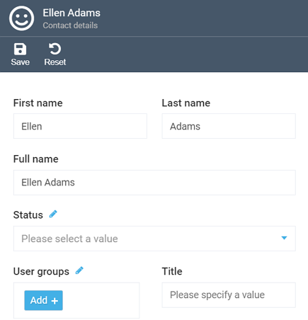
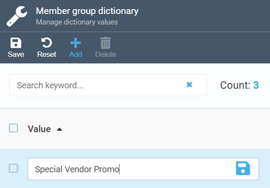
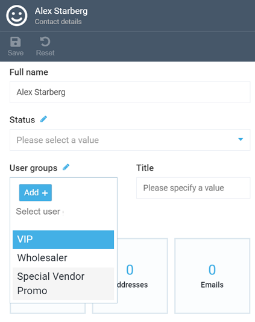
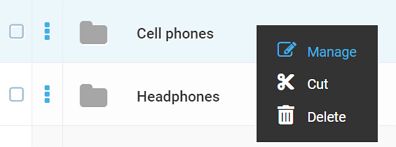
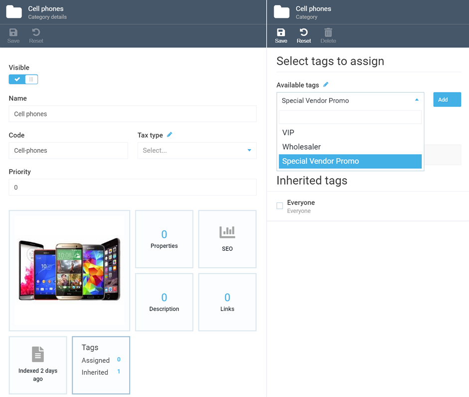
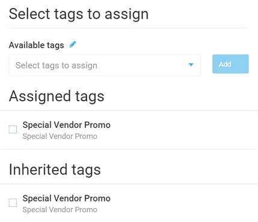

# Working with User Groups
The ***User Group*** feature allows you to include various individual contacts, vendors, and companies into a single group. This will then enable you to assign such a user group to a specific product category, price list assignment, or marketing promotion.

## Creating New User Group
<!---add info panel and link to the Contacts module guide-->
To create a new user group, you should first navigate to the ***Contacts*** module, select any contact from the list to open the user details, and click the pensil icon near the ***User groups*** menu:

In the ***Member groups dictionary*** screen that will show up, enter your new user group name, click the 'Add' button, provide the group name, and hit the floppy icon to save it:

That's it! You can now leverage your new user group to assign it to various entities.

## Assigning User Group to Contact
To include a contact (an individual person, a company, a vendor, etc.) to a user group, open the contact in question through the ***Contacts*** module and select the relevant user group:

Once you are done, click the ***Save*** button in the top panel to save your changes.

## Leveraging User Groups for Price List Assignments and Marketing Promotions

Assigning a user group to price lists and marketing promos will allow you to apply special (e.g., discounted) prices to the selected users and run targeted marketing campaigns. For more info on working with user groups in the dedicated Pricing and Marketing modules, please refer to these guides:

+ [Customer targeting when adding a price list assignment](../pricing/adding-new-assignment.md#customer-targeting)

+ [Customer targeting when managing marketing promotion rules](../marketing/promotion-rules.md#customer-targeting)

## Assigning User Group to Product Category
You can also assign user groups to specific product categories, which may be handy when want to associate such categories or items with a relevant user group.

To perform such an assignment, navigate to the ***Catalog*** module, select the category in question and click ***Manage*** in the right-click menu:

On the ***Category details*** screen that will show up, select the ***Tags*** widget and pick the user group you need in the list under the ***Available tags*** menu:

Click the ***Add*** button and save your changes. The assigned group will be displayed under both the ***Assigned tags*** and ***Inherited tags*** sections:

!!! note
	All category products will inherit the user group tag in question in case the [DownTree propagation](tag-inheritance.md) is enabled.

!!! warning
	Make sure to rebuild the search indexes for categories and products after assigning a tag:

	