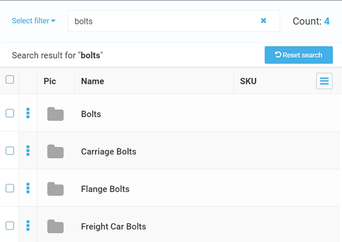
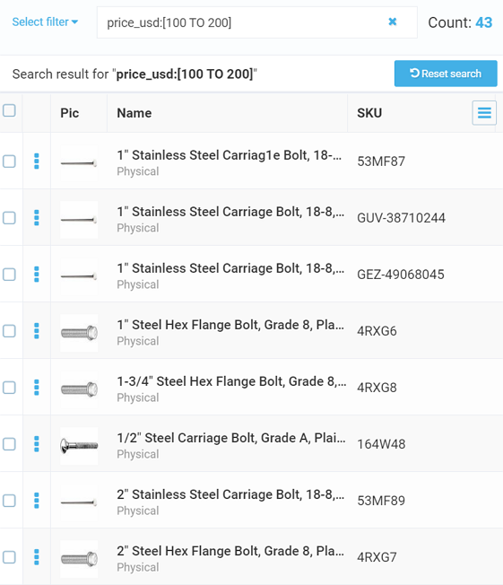
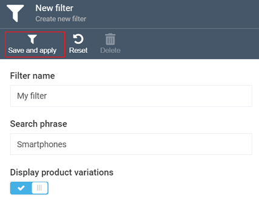

## Search

Virto Commerce offers the Search tool that provides high level relevance, multiple languages, and near-instantaneous responses.

### Key Advantages:
- Document based full text search and text analysis for Products, Categories, and Members   
- Search by keyword, filters, aggregations, and geo-search  
- Supports multiple search engines: Elastic Search, Elastic Cloud, Azure Search, and Lucene
- Inherent complexity of information retrieval processed through REST API or .NET SDK
- The supported document types can be easily extended by a third-party team

### Search Index

The Virto Commerce platform provides a unified solution for indexing and searching for various types of objects. The Search Index is used to improve the search performance and speed.

The indexing process starts automatically based on a pre-defined schedule. However, you can start the indexing process manually at any time, if required.

!!!tip
	You can read more about the search index here: 
	[Managing Search Index](managing-search-index.md)

# Catalog Search
This section explains you how to configure and run search within the Catalog module.

## Key Features
Catalog search includes the following features:

+ Full text search and text analysis​ by keywords
+ Filter by​ text, price range, and categories
+ Aggregations​ with product count for every value
+ Response group​ to limit response content and size
+ Linguistic analysis​ through token filter
+ Geo search​ by distance and radius
+ Sorting and paging​
+ Aggregation property manager​ that helps pick catalog properties eligible for filtering in a specific store.
​
## Types of Search

Virto's Catalog module provides two types of search:

+ Searching by keywords
+ Filtered search

### Searching by Keywords

To run keyword search, perform the following steps:
+ Navigate to the Catalog module.
+ The list of catalogs will show up, with the **Search keyword** text box on the top of the screen.
+ Start typing the keyword you need. The system will start searching with the first letter and display the results on the screen.

For instance, if you type *Bolts*, the system will display the search results as follows:
	
+ Bolts
+ Carriage Bolts
+ Eyebolts
+ Flange Bolts
+ Freight Car Bolts
	

!!! note
	This type of search is available throughout the entire module.

### Filtering

You can search for products through filtering:

+ Navigate to the Catalog module.
+ The list of catalogs will show up, with the **Search keyword** text box on the top of the screen.
+ Open the ***Select filter*** dropdown menu and select the filter you need.
+ The system will return the results based on the specified filter:

#### Adding Filter

You can also add your custom filter by doing the following:

+ Open the ***Select filter*** dropdown menu and select ***Add new filter***:
+ On the ***New filter*** screen, enter the filter name, provide the search phrase, enable or disable displaying variations by toggling the respective button, and click ***Save and apply***:

+ The system will create and apply the new filter, and the filtering results will be displayed on the screen.

