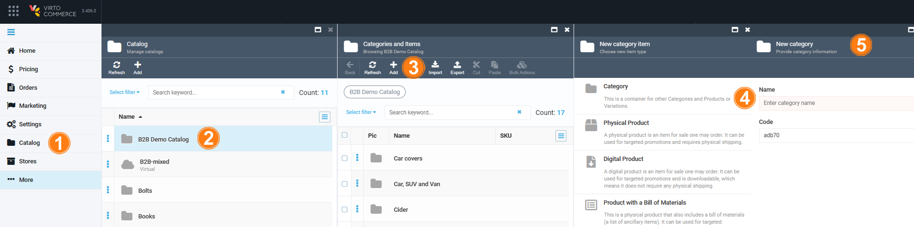
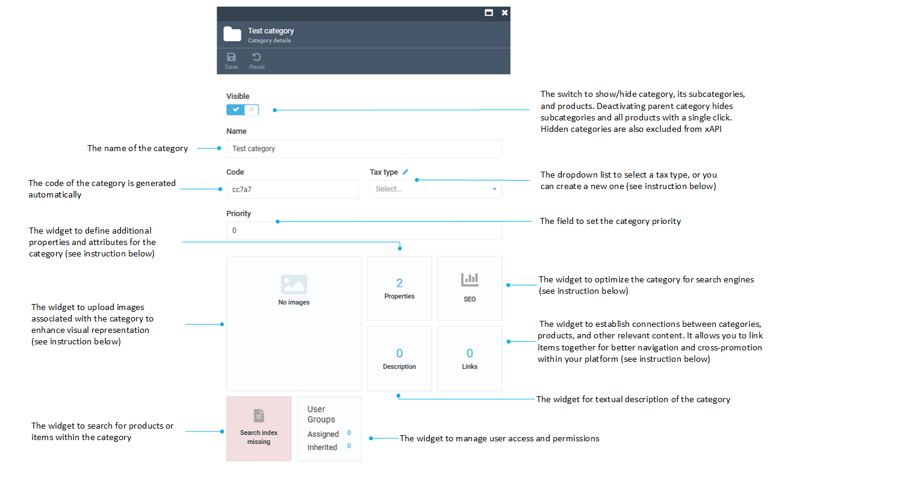
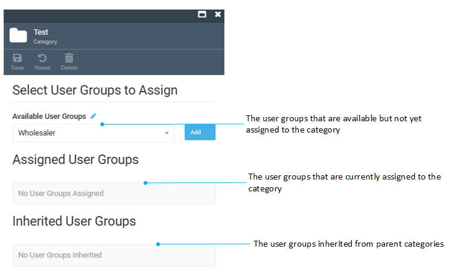

# Managing categories

A category is basically a container for other categories, subcategories, or products.

Categories enable building hierarchies and links between various items in the catalog, which helps the customers navigate to the items they would like to purchase.

If you have large catalogs containing many items, you might want to create multiple categories and subcategories using the parent-child structure.

## Add new category

To add a new category to the catalog:

1. In the main menu, click **Catalog**.
1. In the next blade, select the required catalog.
1. In the next **Categories and Items** blade, click **Add**.
1. In the **New category item** blade, select **Category**.  
1. Fill in the category name. The code is generated automatically.

    

1. Click **Create** to open the category details.
1. Fill in the Category details. 

    

1. Click **Save**. 

Your new category appears in the **Categories** list.

### Tax type

!!! info
	You can add as many tax types as needed. 

To add a tax type:

1. In the **Category details blade**, click {: width="30" height="30"} next to the **Tax type** field to open the **Tax types** blade.
1. Click **Add** in the toolbar.
1. Type the name of the tax type and click {: width="30" height="30"}. 
1. Click **Save** in the toolbar to save the changes.

Your new tax type is displayed in the **Tax type** dropdown list.

### Images

To add images to a category:

1. In the **Category details** blade, click the **Images** widget to open the **Manage Images** blade.
1. Click **Add** to open the **Upload Images** blade.
1. Fill in the fields.

    

1. Click **OK** to save the changes.

Your image(s) have been saved. 

### SEO 

To add a new SEO block:

1. In the **Category details** blade, click the **SEO** widget to open the **Manage SEO** blade.
1. Click **Add** to open the **SEO details** blade.
    
    
 
1. Fill in the fields and click **OK**. 

Your new SEO block has been added to the SEO list.  

### User groups

The **User groups** widget allows you to associate specific user groups with a category. This association can determine which user groups have access to view or interact with the products within that category.

To assign user groups to a certain category:  

1. In the **Category details** blade,  select the **User Groups** widget.  
1. In the next blade, fill in the fields. Click **Add** to assign the available user groups from a drop-down list.

    

1. Click **Save** in the toolbar to save the changes. 

To add new user groups:

1. In the **Category** blade, click {: width="30" height="30"} next to the **Available User Groups** field to open the **Member group dictionary** blade.
1. Click **Add** in the toolbar.
1. Type the name of the tax type and click {: width="30" height="30"}. 
1. Click **Save** in the toolbar to save the changes.

Your new user group has been created.

### Links

To link categories to the catalog items:

1. In the **Category details** blade, click the **Links** widget to open the **Links** blade.
1. Click **Add** to open the **Select catalog items...** blade.
1. Select the desired item (in the example, a virtual catalog from a list of virtual catalogs). You can not select the current category (if it is in the list), categories labelled as Marked, or category links within virtual catalogs.
1. Click **Confirm** to save the changes.

    

The links to the current category within the selected virtual catalogs and categories have been created.

[Read more about the Properties widget](managing-properties.md){ .md-button }