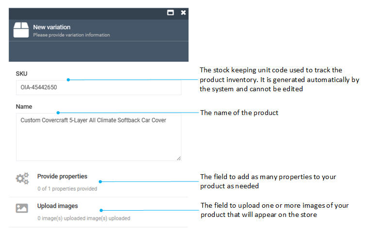
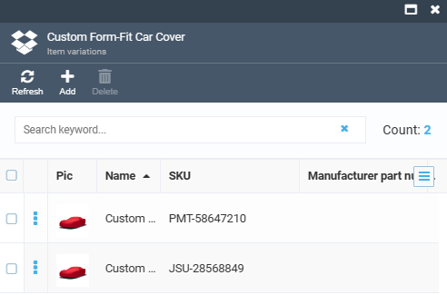

# Managing product variations

In Virto Commerce, we define products as SKUs. Adding variations links a product and its variation(s) together. A product with variations is essentially a collection, with one variation as the title product (master product), while also being a variation itself. Linked products inherit property values from the master product, with the option to override if needed.

To display a product with variations in Storefront, we use the master product, along with its variations. The product description also draws from the master product's properties. Variation properties build the SKU selector for such products.

Variations are individual product entities linked to their master product. For instance, a master product like a mobile phone can have variations like black, white, or red versions, or 5’’ and 6’’ models (or both).
Variations inherit property values from the master product, including descriptions and assets, while also allowing overrides when necessary.

## Add product variation

To add a new variation to a product:

1. Click **Catalog** in the main menu.
1. In the next blade, select the required catalog to open the **Categories and Items** blade.
1. Click the product you need to add variations to.
1. In the next **Physical item details**, click the **Variations** widget. 

    

1. In the next blade, click **Add** in the toolbar to open the **New variation** blade.
1. Fill in the following fields:

    

1. Click **Create** to save the changes.

The new variation is displayed in the **Item variations** list.

## View product variations

To view  product variations:

1. Follow steps 1-4 from the instruction above.
1. The product variations previously added to this particular product are displayed in the **Variations** blade. 

## Asset inheritance

A created product variation automatically inherits all assets and their properties from a parent product. Any subsequent updates to the parent product assets are reflected in the variation assets. After the user edits or adds a new asset to the variation product, inheritance stops automatically, the system makes a copy of the parent assets and adds them to the variation so that changes to the parent assets are no longer reflected in the **Variations**.
