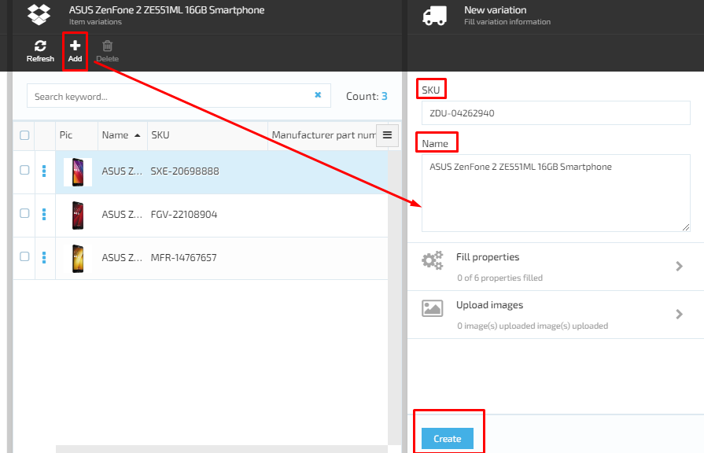
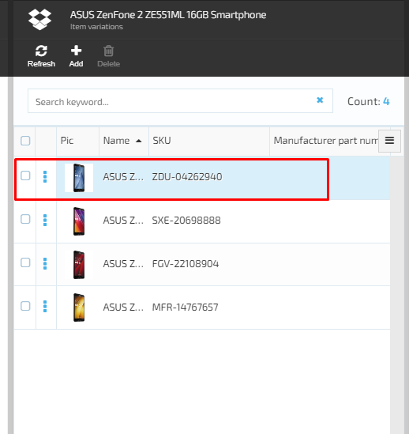

# Managing Product Variations

To add a new variation to a product, got to the ***Item variations*** screen and do the following:

1. Click the ***Add*** button.
2. The ***New variation*** blade will show up and the SKU will be generated automatically. Give the new variation a name and click ***Create***.
3. The new variation will be created and displayed in the product variation list.

