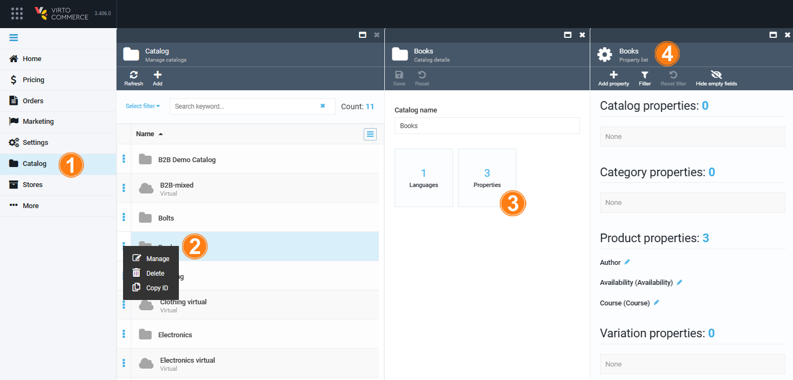
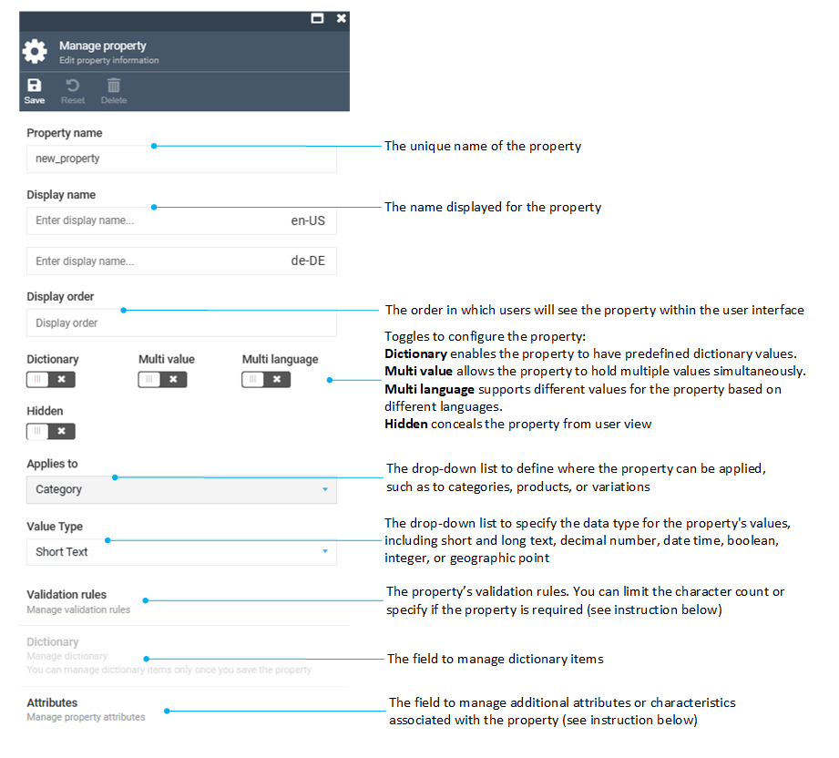
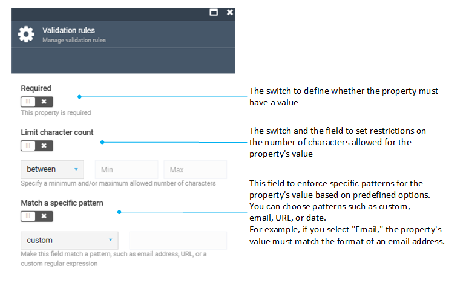
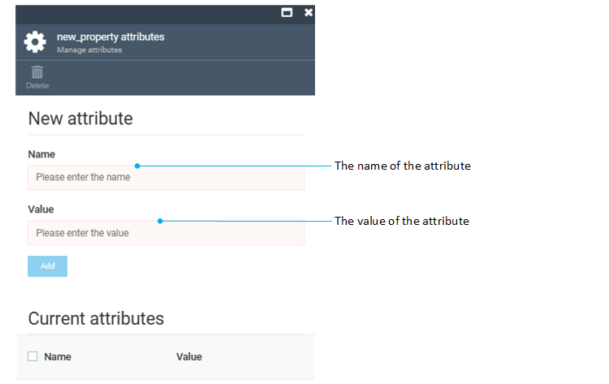
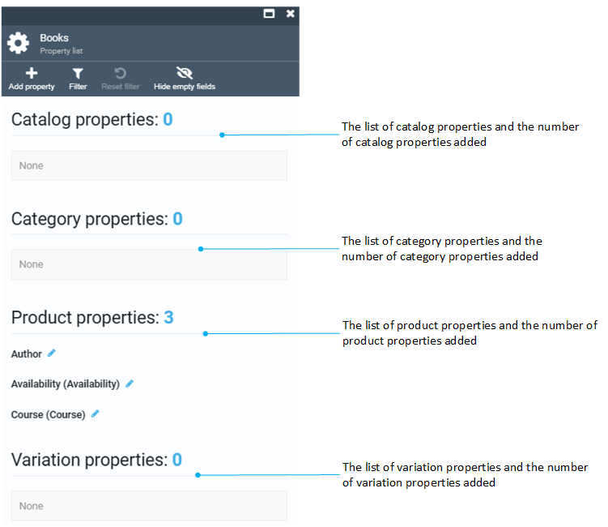

# Managing properties

Custom properties are additional parameters for catalog entities at the follwing levels:

* Catalog level.
* Category level.
* Product level.
* Variation level.

All properties defined at a higher level are automatically inherited at all lower levels. For example, if you assign the **Brand** property with the value **XXX** to a catalog, all categories and products within that catalog will also have **XXX** as their **Brand**.

To start managing properties:

1. In the main menu, click **Catalog** and find the required catalog from the list. 
1. Click on the three dots located on the left side of the catalog name and select **Manage**.  
1. In the next **Catalog details** blade, click on the **Properties** widget. 
1. The **Property list** blade appears. 

     

## Add properties

To add a property:

1. Follow steps 1-4 from the instruction above. 
1. Click **Add property** in the toolbar to open the **New property** blade. 
1. Select the level of the property you need to add:
1. In the next blade, fill in the following fields:

     

1. Click **Save** to save the changes.

The new property has been added to the properties list.

### Validation rules

To manage the validation rules for all the category properties:

1. In the **Edit property information** blade, click **Validation rules** to open the **Manage validation rules** blade.

    

1. Fill in the fields and click **OK** to save the changes.
1. Click **Save** in the toolbar of the **Edit property  information** blade.

The validation rules have been applied.

### Property attributes

To manage the property attributes:

1. In the **Edit property information** blade, click **Attributes**  to open the **new_property attributes** blade. 

    

1. Fill in the fields and click **Add** to save the changes.
1. Click **Save** in the toolbar of the **Edit property  information** blade.

The new attribute has been added to the property attributes list.  

## Edit properties

To edit a property:

1. Follow steps 1-4 from the instruction above. 
1. Click {: width="30" height="30"} next to the property you need to edit.
1. Edit a property.
1. Click **Save** in the toolbar to save changes.

The property has been edited.

## Delete properties

To delete a property:

1. Follow steps 1-4 from the instruction above.
1. Click {: width="30" height="30"} to select a property you need to delete.
1. Click **Delete** in the toolbar and select the appropriate deletion option:
     * Remove only Property metadata and keep the values in the related objects.
     * Delete completely with all related values.
1. Click **Save** in the toolbar to save the changes.

The property has been deleted.

## View properties

To view the list of properties, follow steps 1-4 from the instruction above.

{: width="550" height="550"}

