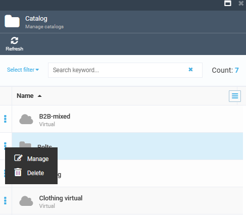
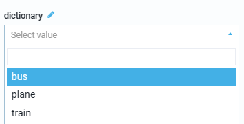
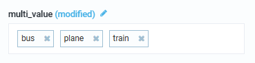
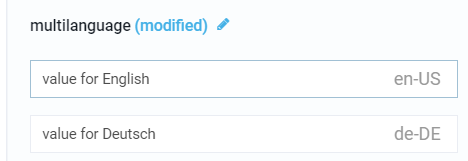

# Managing Properties

Managing properties includes:

* Adding:
     * Catalog properties.
     * Category properties.
     * Product properties.
     * Variations properties.
* Editing properties.
* Deleting properties.

## Adding properties

To add a property:

1. Open the **Catalog** module and select a required catalog from the list. 
1. Click on the three dots located on the left side of the catalog name and select **Manage**.  

     {: width="400" height="400"}

1. In the new **Catalog details** blade, select the **Properties** widget. 
1. The **Property list** blade appears. 
1. Click **Add property** to open **New property** blade. 
1. Select the property you need to add:
     * Catalog property.
     * Category property.
     * Product property.
     * Catalog variation property.

1. Fill in the fields:

     | Field                      	| Description                                                                                                                                                                                        	|
     |----------------------------	|----------------------------------------------------------------------------------------------------------------------------------------------------------------------------------------------------	|
     | **Property name**          	| Name of the property in the property list.                                                                                                                                                         	|
     | **Display name**           	| The property name that is publicly shown or displayed to others (optional).                                                                                                                        	|
     | **Display order**          	| Position of the property in the property list. If no number is selected, the properties are listed alphabetically.                                                                                 	|
     | **Dictionary** switch      	| Enables selecting value from a dictionary. {: width="350" height="300"}  Activates dictionary field in the **Manage property** blade. Select this field to add, edit, and delete dictionary values.           	|
     | **Multi value** switch     	| Enables entering several property values. {: width="350" height="300"}                                                                                                                               	|
     | **Multi language** switch  	| Enables multi-language property values. {: width="350" height="300"}                                                                                                                                     	|
     | **Hidden property** switch 	| If on, excludes properties from xAPI response.                                                                                                                                                     	|
     | **Applies to**             	| Information about a category the property is applied to.                                                                                                                                           	|
     | **Value type**             	| Opens a dropdown list with following values:<ul> <li>Short Text.</li> <li>Long Text.</li> <li>Decimal Numbers.</li> <li>Date time.</li> <li>Boolean.</li> <li>Integer.</li> <li>Geo point.</li> </ul> 	|
     | **Validation rules**       	| Opens **Validation rules** blade.  Specify:<ul> <li>If the property is required.</li> <li>A minimum and maximum number of characters.</li> <li>A specific pattern.</li> </ul>                      	|
     | **Attributes**             	| Opens the **New property attributes** blade to add or delete property attributes.                                                                                                                  	|

1. Click **Save** to save changes.

The new catalog property was added to the catalog properties list.

## Editing properties

To edit a property:

1. Open the **Catalog** module and select a required catalog from the list. 
1. Click on the three dots located on the left side of the catalog name and select **Manage**.  

     {: width="400" height="400"}

1. In the new **Catalog details** blade, select the **Properties** widget. 
1. The **Property list** blade appears. 
1. Click {: width="30" height="30"} to select a property.
1. Edit a property.
1. Click **Save** to save changes.

The property was edited.

## Deleting properties

To delete a property:

1. Open the **Catalog** module and select a required catalog from the list. 
1. Click on the three dots located on the left side of the catalog name and select **Manage**.  

     {: width="400" height="400"}

1. In the new **Catalog details** blade, select the **Properties** widget. 
1. The **Property list** blade appears. 
1. Click {: width="30" height="30"} to select a property you need to delete.
1. Click delete and select the appropriate delete option:

     * Remove only Property metadata and keep the values in the related objects.
     * Delete completely with all related values.

The property was deleted.