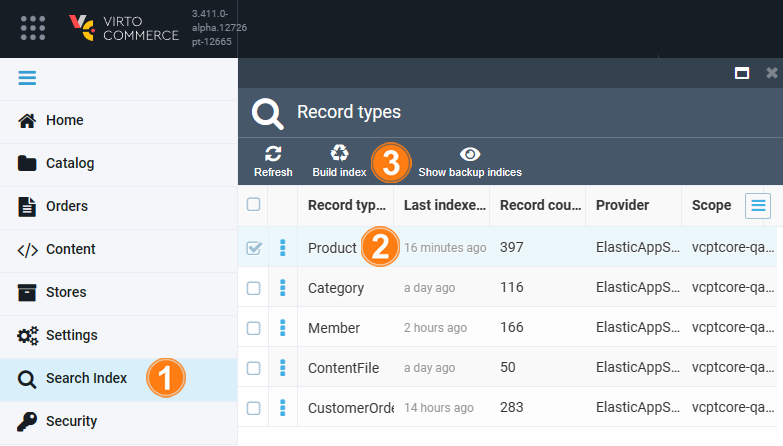
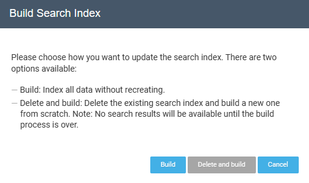
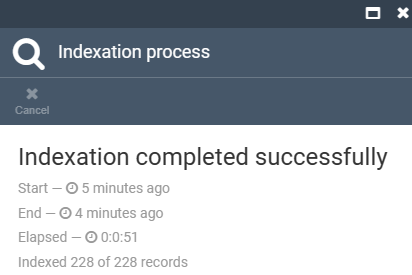

# Manage search index

Virto Commerce uses custom analyzer to extract tokens from the text when building search index. The following token filters are supported:

* custom_edge_ngram (default)
* custom_ngram

To manage search index: 

1. In the main menu, click **Search index**.
1. In the next **Record types blade**, check the required document.
1. Click **Build index** in the toolbar.

     {: width="650"}

1. In the popup window:
     1. Click **Build** to initiate the process of building and indexing all the objects into the search engine.
     1. Click **Delete and build** to delete search index of the selected document and rebuild it from scratch. 

            

1. The result of the indexation process appears in the new blade.

     

The search results will become available once the build process is finished.
