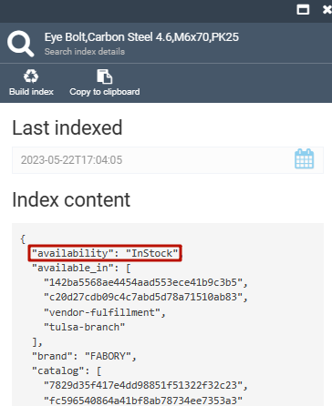

Product inventories are shown in Storefront:

* Under each product card in the catalog. You can apply **Show in stock** filter to see only products in stock.
* In the cart after adding the products. 
* When processing orders.

## How product's availability is determined?

The product's availability displayed in the Storefront is determined by the information configured in:

* The Catalog module, where availability settings are established using switches.
* The Inventory module, storing the actual quantity of the product in stock. 

!!! note
    Although the actual stock is tracked in the **Fulfillment Centers** blade of the **Catalog** module, the blade belongs to the **Inventory** module.  

The diagram below illustrates the sequential process of how the product's availability is initially defined in the **Catalog** module through the use of switches, and then updated in the **Inventory** module with the specific stock quantity.

## Setting availability

To set product's availability:

1. Open the Platform and select the required catalog in the **Catalog** module.
1. In the new **Categories and items** blade, select the required category, then select the item.
1. In the new blade, find the switches. Set the product's availability statuses by switching them on and off in the order they are listed in the table below:

    |Order of setting | Switch | Status | Availability status|
    |---|---|---|---|
    |1| **Visible**  | <ul><li>Off</li>   <li>On</li></ul> | <ul><li>Sold out. **Can be purchased** and **Track inventory** switches do not influence the stock, even if on.</li><li>Depends on **Can be purchased**.</li></ul> |
    |2| **Can be purchased**  | <ul><li>Off</li>   <li>On</li></ul> | <ul><li>Out of stock. **Track inventory** does not influence the stock, even if on.</li><li>Depends on **Track inventory**.</li></ul> |
    |3| **Track inventory**  | <ul><li>Off</li><li>On</li></ul> | <ul><li>In stock</li><li>Depends on the amount specified in the **Inventory** module.</li></ul> |

    !!! info 
        Track inventory switch can be applied to both digital and physical products. By default, the switch is off for digital products, on for physical ones. 

1. In the same blade, click the **Fullfillment Centers** widget.

    

1. Enter or edit the amount in stock by clicking it in the new blade. 
1. Click **Save** to save changes.   

## Checking availability

To check product's availability:

1. Open the Platform and select the required catalog in the **Catalog** module.
1. In the new **Categories and items** blade, select the required category, then select the item.
1. In the new blade, click the **Index** widget.

    {: width="300" height="300"}

1. Find the **availability** line. The **availability** statuses can be as follows:
    * **InStock**.
    * **OutOfStock**.
    * **SoldOut**.

    