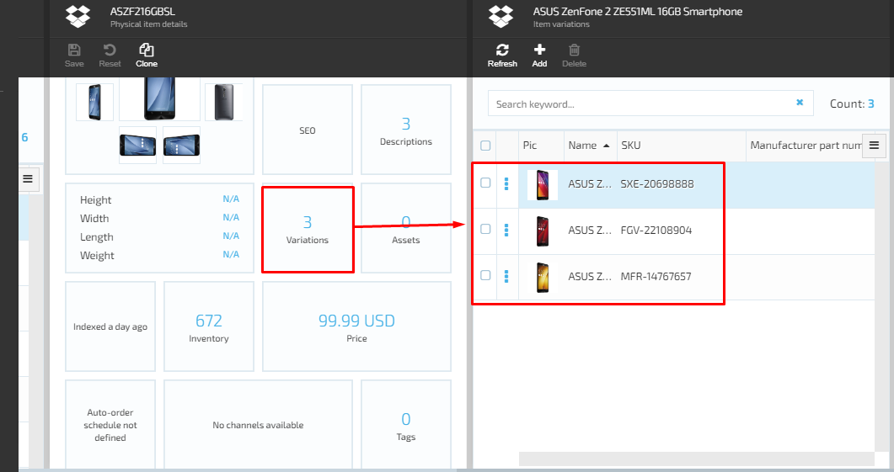

# Viewing Product Variations

To view  product variations:

1. Select the required catalog in the **Catalog** module. 
1. Select a **Category** to view a list of items (products) included into the selected category.
1. Select a product. In the **Physical items details** blade, select the **Variations** widget.

    

1. The product variations that were previously added to this particular product are displayed in the **Variations** blade. 

    

## Asset Inheritance
A created product variation inherits all assets and their properties from a parent product automatically. All subsequent updates in the parent product assets are reflected in the variation assets. After the user edits or adds a new asset to the variation product the inheritance stops being automatic, the system makes a copy of parent assets and adds them to the variation so changes in the parent assets are no longer reflected in the **Variaitons**.
