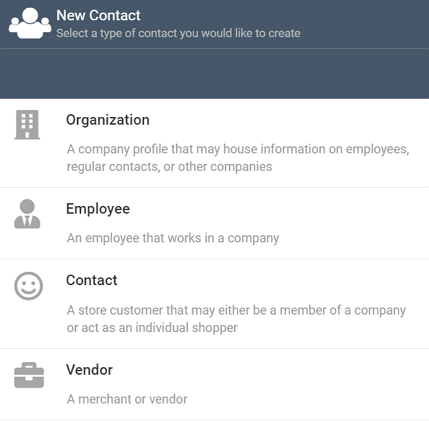
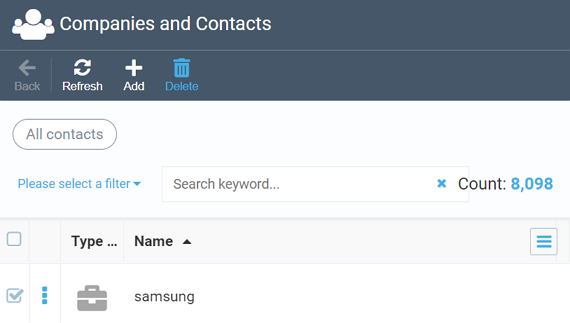

# Managing Contacts
Managing contacts includes adding, editing, and deleting various contact entities (companies, employees, customers, and vendors) using the Contacts module.

## Adding Contacts
To add a contact, navigate to the Contacts module and hit the ***Add*** button. This will open up the following screen:

Here, you can pick the entity  you need and start creating your contact. As an example, we will use the Organization (Company) option.

After you pick the ***Organization*** (Company) option, the following screen will show up. The only required field is ***Name***, which will be highlighted red in case not filled out.

In the ***User groups*** field, you can pick the groups you would like to add this company to. For more details on user groups, please refer to [this guide](https://docs.virtocommerce.org/new/user_docs/catalog-personalization/user-groups/).

The ***Status*** field allows you to specify where you are with this company, in terms of working with it. The options available are ***New***, ***Approved***, ***Rejected***, and ***Deleted***.

!!! note
	The ***Approved*** and ***Rejected*** statuses are mostly used when the company has already been added to contacts, i.e. when you edit the contact record and need to change the status after running the appropriate communication with the company in question.

The ***Addresses***, ***Emails***, and ***Phone numbers*** widgets are self-explanatory. Use them to add the respective contact details. You can add any reasonable number of physical addresses, emails, and phone numbers.

You can also add the company's business domain and provide a reasonably short description, so that other people working with your contact base may understand what it is about.

Finally, you can add the company icon (logo), which will help you tell it from other companies in the list.

Once you hit the ***Create*** button, the company you added will appear in the ***Companies and Contacts*** list.

!!! note
	Creating other contact profiles, such as employees and regular contacts (individual customers), is very much like adding a company profile. The two main differences are required fields (for individual contacts, you must provide both first name and last name), and some specific fields that are valid only for this specific contact type.

## Editing Contacts
To edit any previously added contact, you just need to click the contact record in question on the main contact screen. From there, you can edit any fields you need.

## Deleting Contacts
If you realize you no longer need a contact, you can remove it by ticking the checkbox next to it on the ***Companies and Contacts*** screen and hitting the ***Delete*** button:

