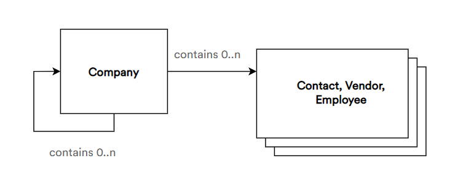

# Contacts Module Overview
The Contacts module allows you to manage various profiles within Virto Commerce, which includes companies, vendors, and individual customers.

## Related Components
To view the source code of Virto Commerce Contacts module, check out our [GitHub repository](https://github.com/VirtoCommerce/vc-module-customer).

To download the latest Marketing module release, click [here](https://github.com/VirtoCommerce/vc-module-customer/releases).

## Key Concepts
The chart below shows the Contacts module's core entities and how they are related to each other:

### Terms and Definitions:

The Contacts module provides an option to create and manage entities of the following types:

+ **Company (Organization):** A profile for an entire company, within which you can store employee profiles, other company profiles, and those of individual customers related to that company
+ **Employee:** A profile of an employee working for a specific company
+ **Contact (Customer):** A profile for a customer of your store; may be either an individual customer or a member of a company
+ **Vendor (Merchant):** A profile for a vendor you work with 
  
## Key Features
The Contacts module has the following features:

+ **Many-to-many company entity hierarchy:** Each company entity may comprise multiple companies, along with individual users.
+ **Linking to user accounts:** You can link your contact profiles to the account credentials (e.g. email or username) they use when shopping from your store.
+ **Easy contact management:** Create, link, edit, or remove your contacts with just a few clicks.
+ **User groups:** Allows you to create groups that include specific users. This may come in handy for promotion targeting, offering special prices to specific customers, etc. You can read more about user groups [here](https://docs.virtocommerce.org/new/user_docs/catalog-personalization/user-groups/).
+ **Connection to Storefront:** You can link all your contacts and their hierarchy to the Storefront application.

## More on Contacts Module
Learn how to manage:

+ [Contact profiles](managing-contacts.md)
+ [Contact module settings](settings.md)
