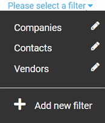

# Searching in Contacts Module
It is highly likely that you will eventually have to manage a lot of company, customer, and vendor profiles, as long as your business is growing. It is not at all uncommon to have, say, a few thousand records or even more.

With so many records, you will need some searching and filtering options in order to quickly find a profile in question. This is exactly what Virto provides.

## Searching by Keyword
This is the easiest way to find a profile you are looking for. You can type a company or customer name, or just a part of it, into the keyword search bar, and, most likely, it will return the results you need:

As you can see, both companies called *New Company* got found after typing the *New* keyword.

## Filtering
By default, you can filter all your contact entities by companies, contacts, and vendors:

As you can see, you can also add your custom filter by selecting the relevant option. Your new filter may be based on record content, create dates, and more. To configure your filter, you will need to provide a search phrase. This is not that self explanatory; however, the UI provides you with some reference that tells you how to use various search phrases:

In the example above, the filter is configured to show all records created between November 9 and November 11, 2022.

Once you save your new filter, it will appear in the list and become available to you:

You can also edit your filter parameters at any time.
