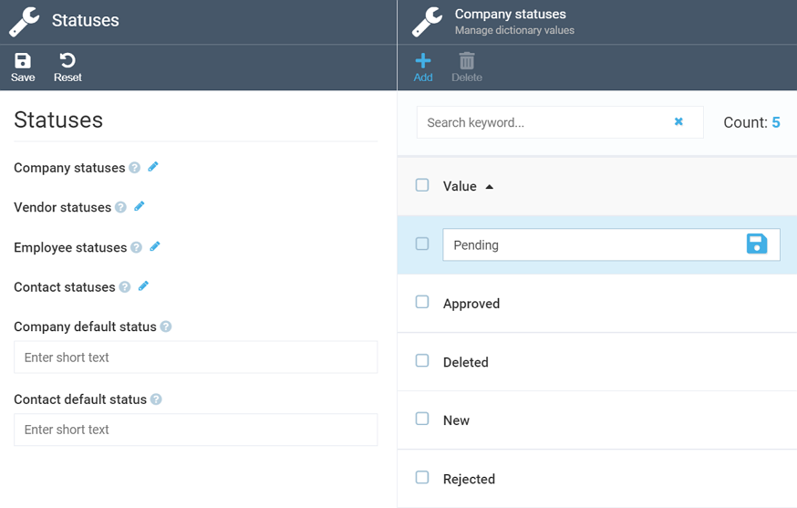

# Contact module settings

The Contact module settings include:

* [General settings.](settings.md#general-settings)
* [Settings for contact entities statuses.](settings.md#statuses)

## General settings

To configure general settings:

1. Click **Settings** in the main menu.
1. In the search field of the next blade, type **Customer** to find the settings related to customer.
1. Select **General**.
1. In the next blade, configure the general settings:

    

1. Click **Save** in the toolbar to save the changes.

Your modiciations have been saved.

## Statuses

To add and edit statuses for various contact entities: 

1. Click **Settings** in the main menu.
1. In the search field of the next blade, type **Customer** to find the settings related to customer.
1. Select **Statuses**.
1. In the next blade, configure the statuses. In the example below, we add the **Pending** status to the **Company** entity:

    {: width="600" height="600"}

1. Click **Save** in the toolbar to save the changes.

Your modiciations have been saved.