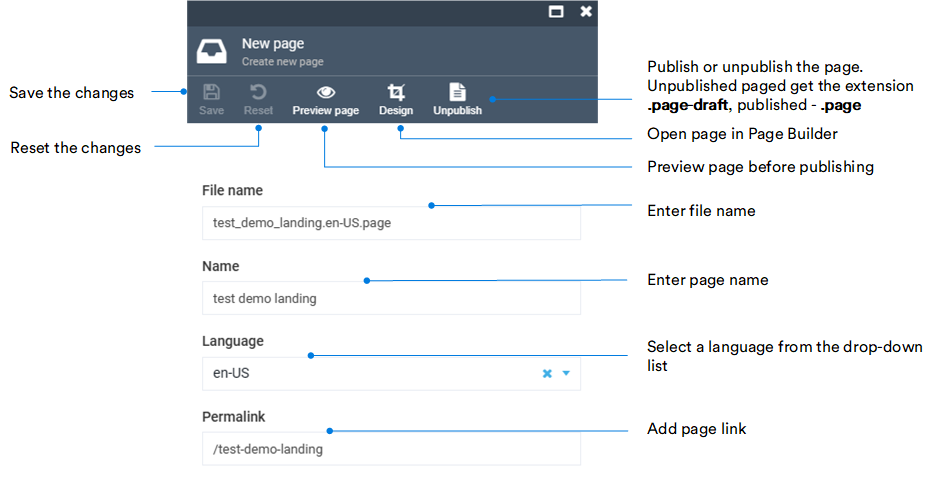

# Manage pages

Clicking on the **Pages** widget opens the list of the all pages your Storefront consists of. 

From the **Pages list**, you can:

* Add new pages.
* Upload new pages.
* Delete pages.
* Organize your pages into folders.

Pages can have the following extensions:

* **.page** - for pages that have been created in Page Builder and published.
* **.page-draft** - for pages that have been created in Page Builder, but have not yet been published.
* **.md** - for pages that have been created using markdown or html.

Click on the three dots to left of the page name to:

* Download it.
* Copy its link.
* Delete it.

{: width="550"}

## Edit page

In the **Pages list** blade, select the desired page and edit the following fields:

