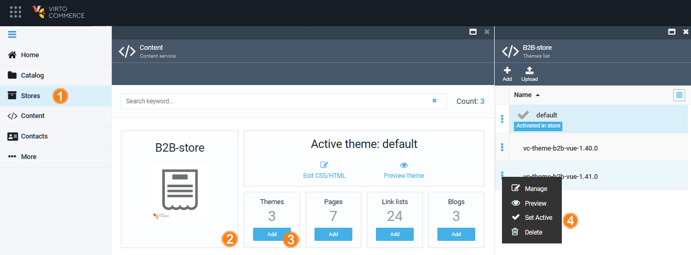

# Manage themes

The Virto Commerce Theme is a frontend application for your ecommerce websites. The default Theme is included in the VC Content module and is provided out of the box. The default theme consists of the following folders with files that define the Storefront UI:

| Folder        	| Content                                                                                                    	|
|---------------	|------------------------------------------------------------------------------------------------------------	|
| **assets**    	| Scripts, styles and other assets compiled and minified for production.                                     	|
| **config**    	| The Virto theme settings.                                                                                  	|
| **layouts**   	| Layout templates used to render the theme within the Storefront.                                              |
| **locales**   	| Locale files used to provide translated content for the theme.                                             	|
| **snippets**  	| Liquid snippets, included in Liquid templates.                                                             	|
| **templates** 	| Liquid templates, used in SSR and MPA. Each MPA page must have a liquid template here if you want SSR. 	    |

The theme structure should be predefined in advance and is created by a developer.

The Virto Commenrce Content module allows you to:

* Add as many themes as needed.
* Set an active theme to be displayed on the Storefront.

Managing theme includes:

* [Adding new theme.](managing-themes.md#add-new-theme)
* [Uploading new theme.](managing-themes.md#upload-new-theme)
* [Activating theme.](managing-themes.md#activate-theme)
* [Managing theme assets.](managing-themes.md#manage-theme-assets)

## Add new theme

To add a new theme:

1. Click **Content** in the main menu.
1. Select the store from the list t=in the next blade.
1. Click on the **Themes** widget.
1. In the **Themes list** blade, click **Add** in the toolbar. 
1. Enter the name of the new theme. 
1. Click **Create** to create your new theme. 

The new theme appears it in the themes list.

## Upload new theme

To upload a theme zip file:

1. Click **Content** in the main menu.
1. Select the store from the list in the next blade.
1. Click on the **Themes** widget.
1. In the **Themes list** blade, click **Upload** in the toolbar. 
1. Drag and drop or browse the zip file. 

Once the zip file has been uploaded, it will be unzipped and added to the Themes list.

If a new theme has been created by the developer, it can be uploaded to a new environment using a zip file.

## Activate theme

To activate the theme:

1. Click **Content** in the main menu.
1. Select the store from the list in the next blade.
1. Click on the **Themes** widget.
1. In the **Themes list** blade, click the three dots to the left of the desired theme and click **Set active**.

The theme is now active.

## Manage theme assets

To manage the theme assets:

1. In the **Themes list**, select the desired store.
1. Click the three dots to the left of the folder to copy its link or delete it.
1. Click the three dots to the left of the file to copy its link, download, or delete it.

