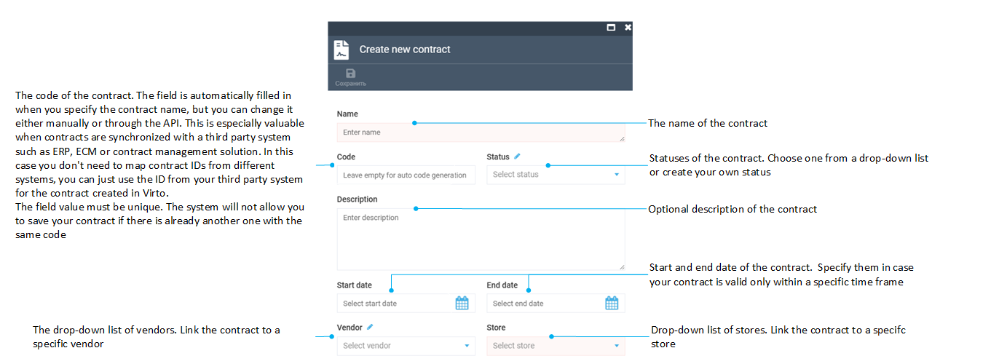
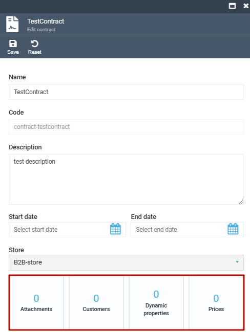
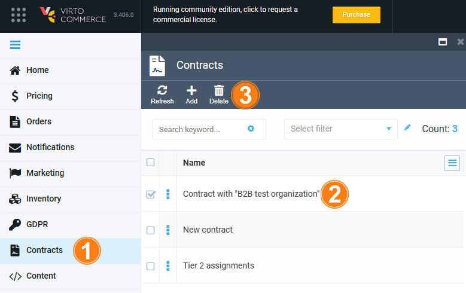

# Creating and Terminating Contracts

To work with contracts, you will first need to navigate to the ***Contracts*** module. Once you do so, you will be able to see the list of your current contracts:

## Creating New Contract

To create a new contract, click the ***Add*** button on the top toolbar, which will open the ***Create new contract*** screen:

Here, you will need to provide data to three required fields: give your contract a name, supply code, and select the store this contract will be applicable to.

!!! tip
	Actually, the ***Code*** field will get filled in automatically once you provide the contract name; you will be able to change it, however, either manually or through API. This is especially valuable in case contracts are synchronized with a third party system, such as ERP, ECM, or contract management solution; in this case, you won't need to map contract IDs from different systems, you may just use the ID from your third party system for the contract being created in Virto.
	
!!! warning
	The ***Code*** field value must be unique. The system will not allow you to save your contract if there is already another one with the same code.

The ***Start date*** and ***End date*** are not required, but you will need to specify them in case your contract is valid only within a specific time frame.

Once you hit ***Save***, your new contract gets created and a few new widgets become available:

You can now use these widgets to add [prices](managing-contract-prices.md), [customers](managing-contract-customers.md), and other information to your new contract.

## Terminating Contract
To terminate a contract, select one or more contracts in the contracts list, click the recycle bin icon on the top toolbar, and confirm your action:

!!! warning
	After your contract is deleted, you will have no options to restore it. Make sure to double-check everything before you proceed to termination.
