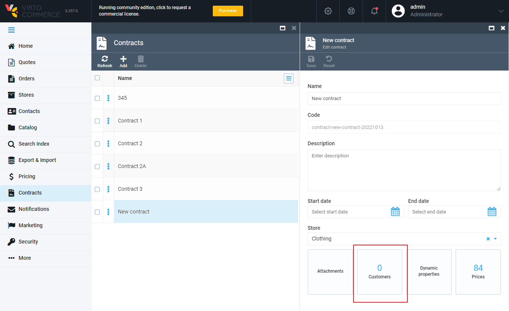
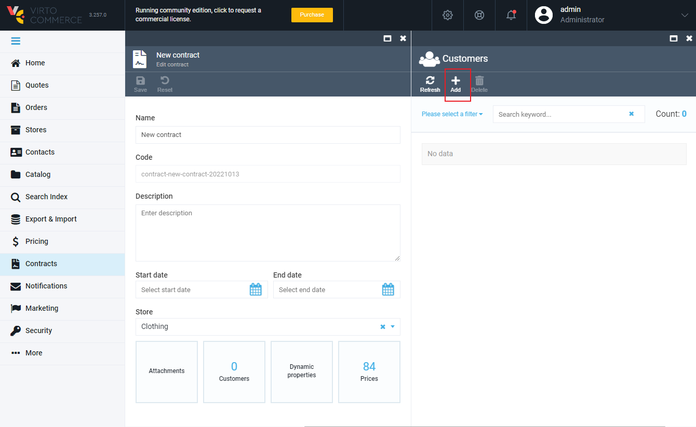
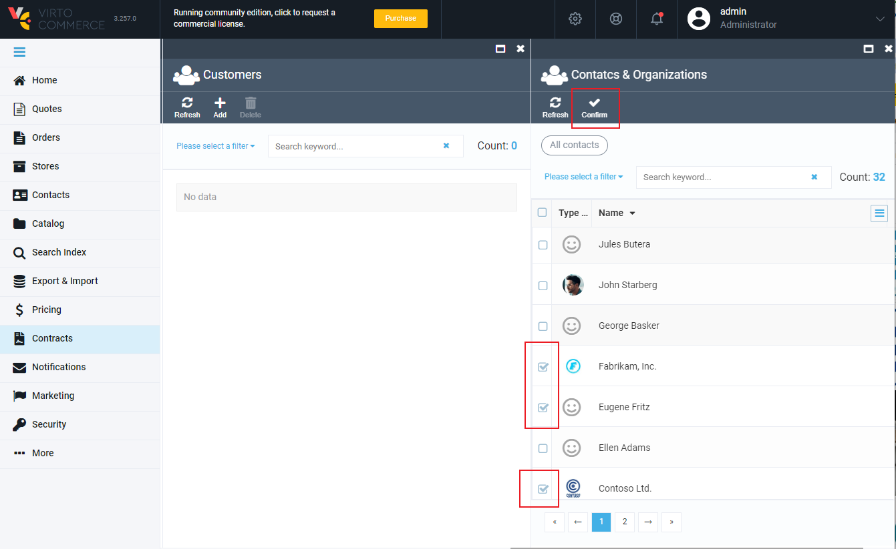
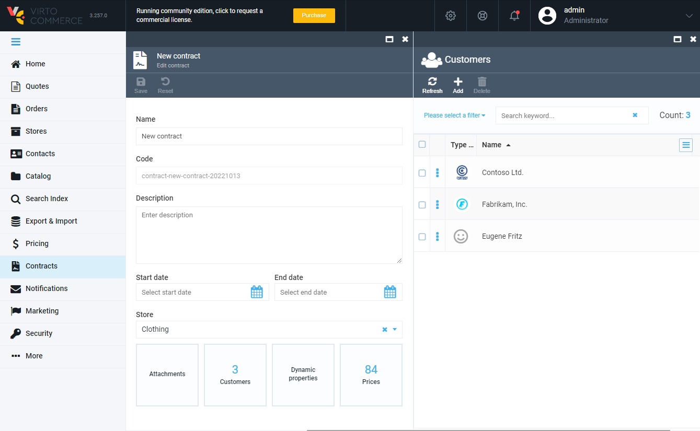
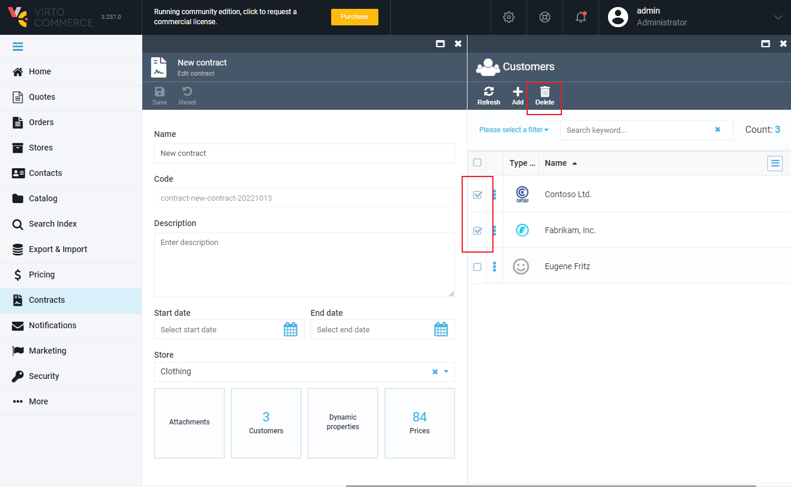

# Managing Contract Customers

## Adding Companies to Contract
To manage the list of customers who are linked with the contract (i.e., get prices based on this contract), click the ***Customers*** widget:

This will open the ***Customers*** screen, where you need to click the ***Add*** button:

This will open the screen with the full list of contacts and companies. Select the companies you need to add them to your contract. This will also add all child companies and related contacts, so it is not required to add each individual user.

When you are done, click the ***Confirm*** button:

That's it, the specified companies have now been added to the contract:

## Removing Companies from Contract

To remove a company from your contract, select one or more companies that should be removed and click the ***Delete*** button on the top toolbar:

