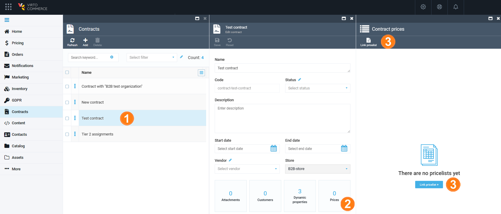
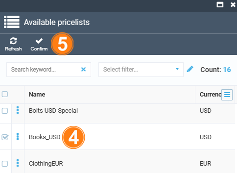
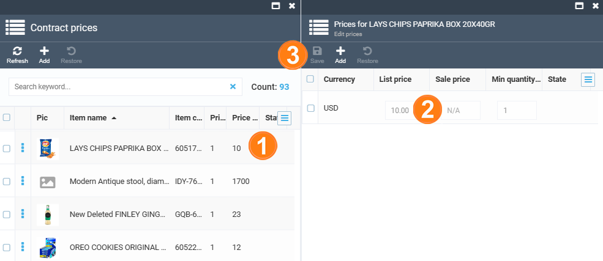

# Managing contract prices 

Managing contract prices includes:

* [Adding default price list to the contract](managing-contract-prices.md#adding-default-price-list-to-contract)
* [Updating contract prices](managing-contract-prices.md#updating-contract-prices)
* [Restoring default contract prices](managing-contract-prices.md#restoring-default-prices-in-the-contract)

## Adding default price list to contract

The newly created contract is not assigned a price list by default.

To add a price list to the contract:

1. Select the contract in the **Contracts** blade.

1. In the next blade, click the **Price** widget to open the **Contract prices** blade.

1. In the next blade, click **Link pricelist**.

	

1. In the next **Available pricelists** blade, check the price list you want to use as the default.

1. Click **Confirm** in the toolbar.

	{: width="400" height="400"}

The appropriate prices will be displayed in the **Contract prices** blade.

## Updating contract prices

To update the prices after adding a default price list:

1. In the **Contract prices** blade, click the product to open the edit price blade. 

1. Enter new prices to the **List price** or **Sale price** fields.

1. Click **Save** to save the changes.

	{: width="700" height="700"}

To create a new price to be used when the price differs based on a different minimum quantity:

1. Click **Add** in the toolbar.

1. Fill in the required fields.

1. Click **Save**. 

{: width="700" height="700"}

The prices will now be marked as **Updated** and **New**, while the product you changed the prices for will get marked as **Modified**:

{: width="700" height="700"}

!!! note
	Any changes you make to the prices in your contract will not affect the default price list. These changes only overlap the default prices in that specific contract. This means that a single default price list can be used for multiple contracts, and these contracts will not affect each other.
	
	At the same time, if you [modify the price list using the **Pricing** module](../pricing/creating-new-price-list.md), the changes will automatically be applied to all contracts that have it as the default price list.

### What happens in the backend

When you update contract prices, a new price list is created to keep these changes. 
This price list is accessible in the [Pricing module](../pricing/overview.md) as `Contract-YourContractName-DefaultPriceListName` (`Contract-b2b test organization-MFDUSD` in the picture below):

{: width="700" height="700"}

!!! note
	The `YourContractName` part of the price list name is the name you originally gave to your contract. 
	
	If you named your contract `My contract` and then renamed it to `My contract (new)`, the price list name will still have `My contract`.

!!! note
	Each contract has only one related price list with changes. This means that all updates made at any time are stored in a single price list.

To make the default price and the contract price updates applicable for the customer the contract refers to, two new price list assignments are created:

* The one with the suffix `-Base` refers to the default price list.
* The one with the suffix `-Priority` is the price list with updated prices:

{: width="700" height="700"}

!!! note
	The assignment having the `-Priority` suffix logically has a higher priority, and its prices overlap the default prices.

## Restoring default prices in the contract

To restore the initial price:

1. In the **Contract prices** blade, click the product to open its edit price blade. 

1. Check the price line you need to restore.

1. Click **Restore** in the top toolbar.

	{: width="700" height="700"}

1. Confirm your action.

This works both at the product and price level. After you restore the prices, the **New** label that marked them will disappear.
