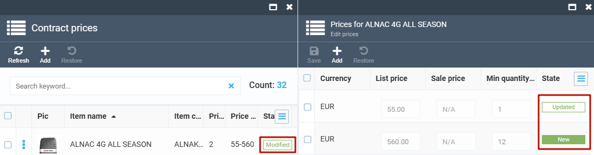
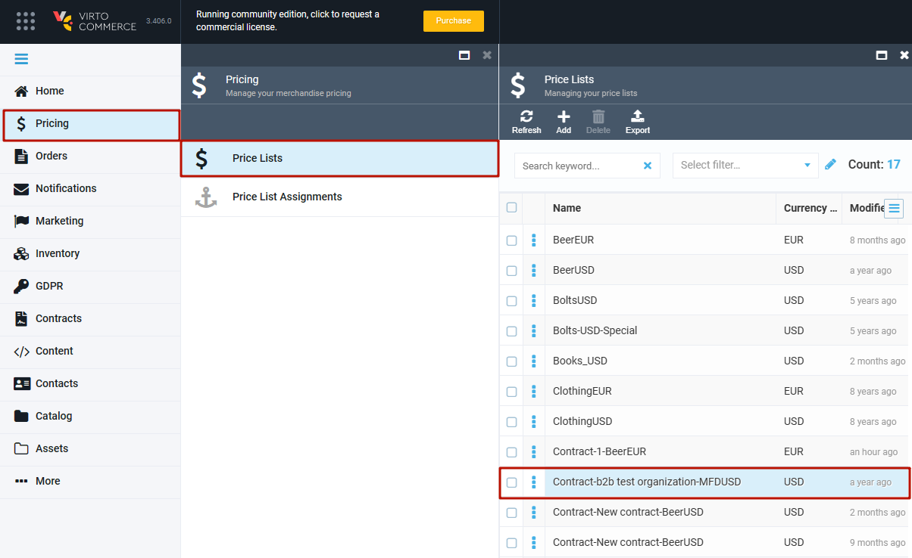
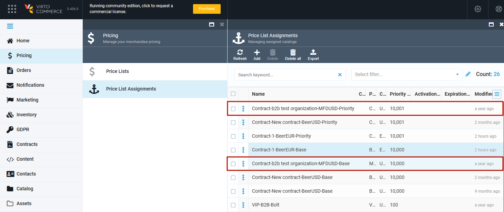
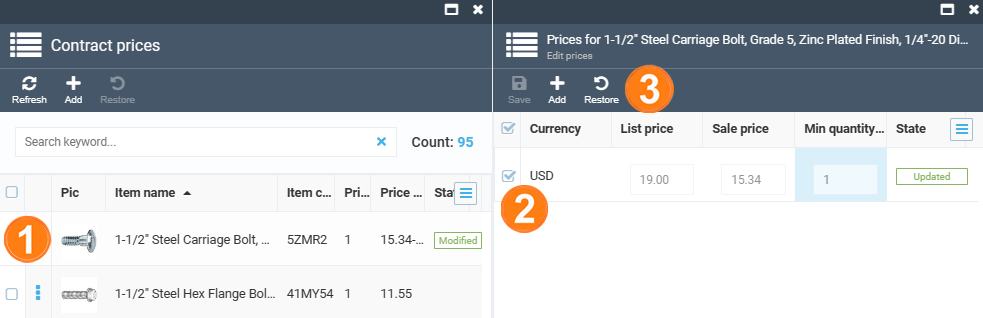

# Managing Contract Prices 

## Adding Default Price List to Contract
After you create a new contract, you will need to add a price list to it, as it won't get any price list assigned by default.
 
To do so, click the ***Price*** widget at the bottom of the contract screen to open the new ***Contract prices*** screen, and then click the ***Link price list*** button:

On the ***Available price lists*** screen that will  show up, select the price list you would like to use as default and click the ***Confirm*** button on the top toolbar:

After adding the default price to your contract, the appropriate prices will be displayed on the ***Contract prices*** screen:

## Updating Contract Prices

The purpose of a contract is to provide unique custom prices for your customer. This means that, highly likely, you will need to change the prices after adding a default price list.

To update a price, click the product name on the ***Contract prices*** screen , which will take you to the ***Edit price*** screen. Here, click the ***List price*** or ***Sale price*** field and insert the new value.

To create a new price (useful when the price differs based on  another minimum quantity), click the ***Add*** button on the top toolbar:

Once you are done, click ***Save***. The prices will now be marked as ***Updated*** and ***New***, while the product you changed the prices for will get marked as ***Modified***:

!!! warning
	Any changes you make to the prices within your contract do not impact the default price list. These changes are overlapping the default prices in this specific contract only. This means that a single default price list might be used for multiple contracts, and these contracts will not affect each other.
	At the same time, if you [modify the price list through the ***Pricing*** module](../pricing/creating-new-price-list.md), the changes will be applied automatically to all contracts that have it as a default price list.

### What Happens on Back End

When you update contract prices, a new price list is created to keep these changes. This price list is accessible though the [Pricing module](../pricing/overview.md) as `Contract-YourContractName-DefaultPriceListName`, which, in our case, is `Contract-New contract-BoltsUSD`:

!!! note
	The `YourContractName` part of the price list name means the name you initially give to your contract. That is, if you named your contract `My contract` and then renamed it to, say, `My contract (new)`, the price list name will still have `My contract`.

!!! note
	Each contract has only one related price list with changes. It means that all updates made at any time will be stored in a single price list.

Besides, to make the default price and the contract price updates applicable for the customer the contract refers to, two new price list assignments are created. The one having the `-Base` suffix refers to the default price list, while the one with the `-Priority` suffix stands for the price list with updated prices:

!!! note
	The assignment having the `-Priority` suffix has, logically, a higher priority, and its prices overlap the default prices.

## Restoring default prices in the contract

To restore the initial price, select the price line you need to restore and click the ***Restore*** button on the top toolbar:

This works both on the product and price level.

After you restore the prices, the ***New*** label that marked them will be gone.

