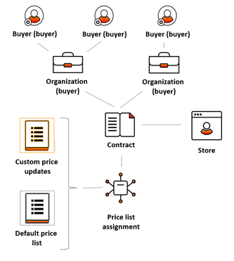

# Overview

***Contracts*** is a Virto’s module that enables creation and management of customer contracts. Each contract defines prices the customer gets during the contract period. The feature was designed with B2B companies in mind.

The contract feature is based on the native Virto Commerce personalization engine in order to provide comfortable employee experience for users who manage B2B customer personalization.

The chart below shows how various high-level entities are linked one to another in the Virto Platform:

By creating a contract, you link the buyer company, or contact, with the price list that will be applicable to the company during the contract period in the selected store.

To simplify user experience for those who manage contracts, there is an option to select an existing price list as a `_default_` one for the contract and then update specific prices within it. This enables creating large custom price lists with minimum effort.

You can also use the same contract for multiple organizations, which is especially valuable for companies that sell goods or services to businesses with complicated organizational structure.

Once you create a contract, the system will automatically:

1.  Create a new user group, which is equal to the unique contract code

2.  Assign the created user group to the companies that are included into the contract

4.  Create a new price list assignment that will link the default price list with the new user group (equal to contract code)

5.  Create a new price list with all contract custom price updates registered

6.  Create a new price list assignment that will link the new price list with the new user group (equal to contract code).
    
All these changes may get recorded to the appropriate entities (companies, price lists, and price lists assignments), if required, while the user who manages contracts can easily work with the module without being aware of all these details.

## Related Components

To view the source code of Virto Commerce Contract module, check out our  [GitHub repository](https://github.com/VirtoCommerce/vc-module-contract).

To download the latest Contract module release, click  [here](https://github.com/VirtoCommerce/vc-module-contract/releases).

## Key Features
Virto's Contract module contains the following key features:

+ [Managing contracts](creating-and-terminating-contracts.md)
+ [Managing contract prices](managing-contract-prices.md)
+ [Managing contract customers](managing-contract-customers.md)
