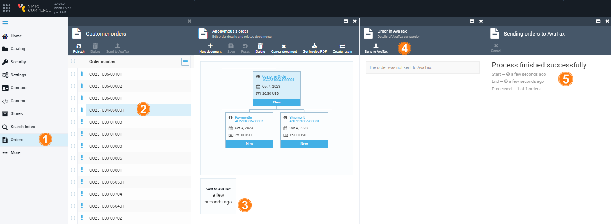
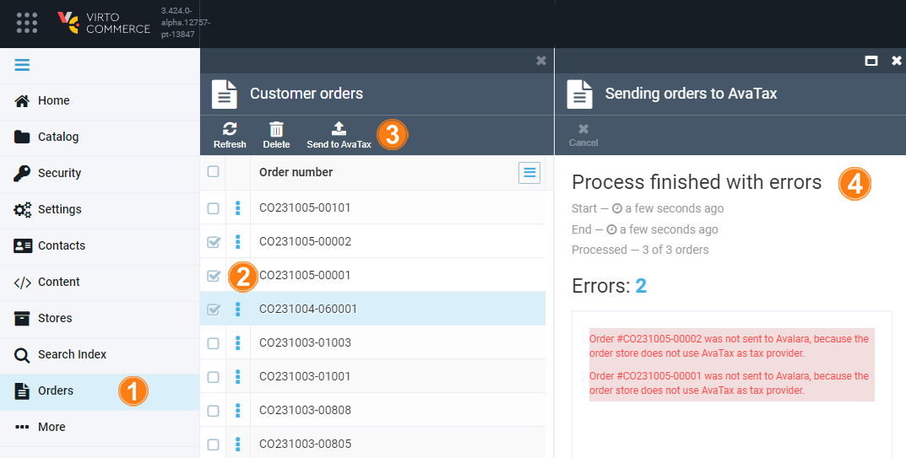
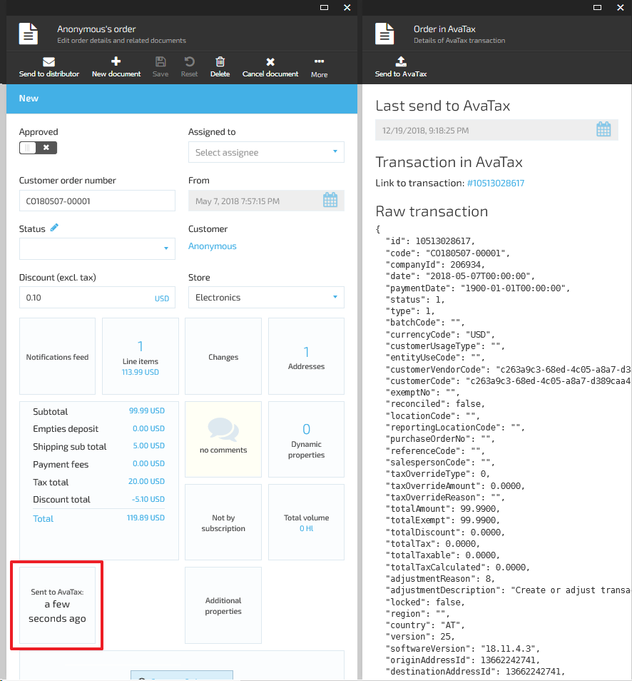

The AvalaraTax module creates AvaTax transactions for orders and enables scheduled synchronization of VC Platform orders with AvaTax. 

It creates a **SalesInvoice** transaction for orders, where:

* Document code matches order number.
* Document date matches order date.
* Line items contain all line items from the order plus one more line item for the shipping.

You can send the order to AvaTax:

* Automatically: 
    * Enable the `Avalara.Tax.ScheduledOrdersSynchronization.IsEnabled` setting.
    * Adjust the schedule in the `Avalara.TaxScheduledOrdersSynchronization.CronExpression` setting.
    * Wait for the job to complete.
* Manually:
    * For a single order: 
        * Go to **Order details**.
        * Click the AvaTax widget.
        * Click **Send to AvaTax**.
        
    * For multiple orders: 
        * Go to the orders list blade.
        * Select the required orders.
        * Click **Send to AvaTax**.
        

!!! note
    * Set **AvaTax** as a tax provider for your store to send transactions to AvaTax.

To review the AvaTax transaction details for the order, click the AvaTax widget on the order details blade. 
It displays:

* The date the order was sent to AvaTax.
* The link to the AvaTax transaction corresponding to the order.
* Raw AvaTax transaction representation.

