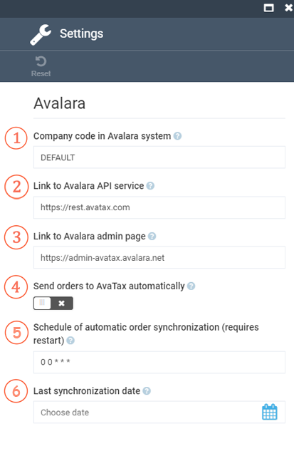

To open Avalara settings, go to Stores > (select your store) > Tax providers > Avalara Tax Provider > Settings.

Fill in the fields as follows:

| Item | Description                                                                                                                                                                                                |
|------|------------------------------------------------------------------------------------------------------------------------------------------------------------------------------------------------------------|
| 1    | Company code that should match with the code provided to the company registered in Avalara admin manager.                                                                                                  |
| 2    | Link to Avalara API service.                                                                                                                                                                               |
| 3    | Link to Avalara admin page. Used for building links to AvaTax transactions.                                                                                                                                |
| 4    | Scheduled synchronization of VC Platform orders with AvaTax (requires restart).                                                                                                                            |
| 5    | Schedule of automatic order synchronization.  For **x minutes** use `0/x * * * *` or `15 */x * * *`   For **x hours** use `0 */x * * *`   For **x days** use `0 0 */x * *` |
| 6    | Last synchronization date. If empty, the order synchronization job will process all orders in the database.                                                                                                                                                                                                           |