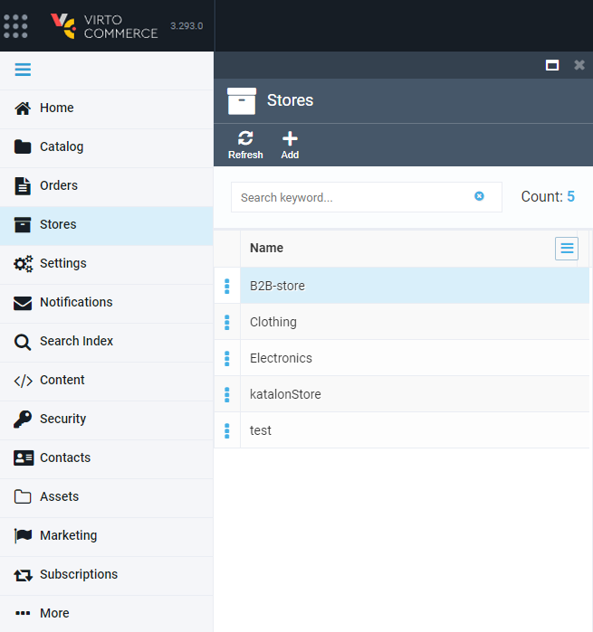
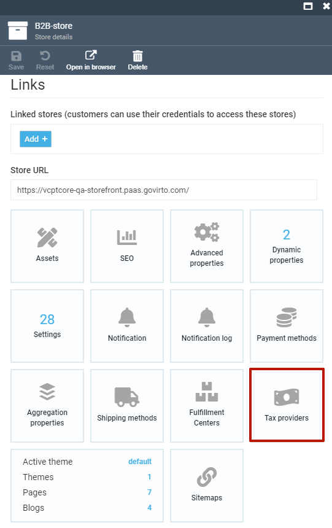
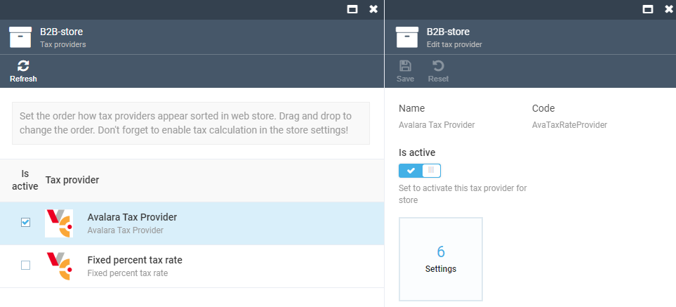
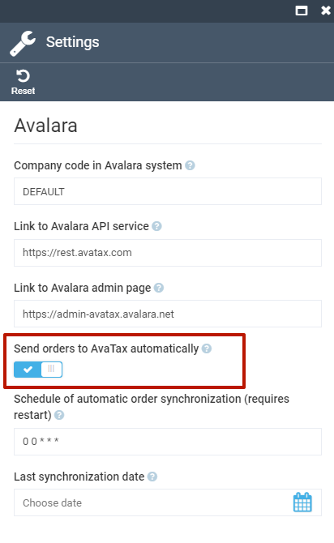
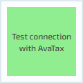
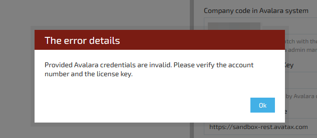
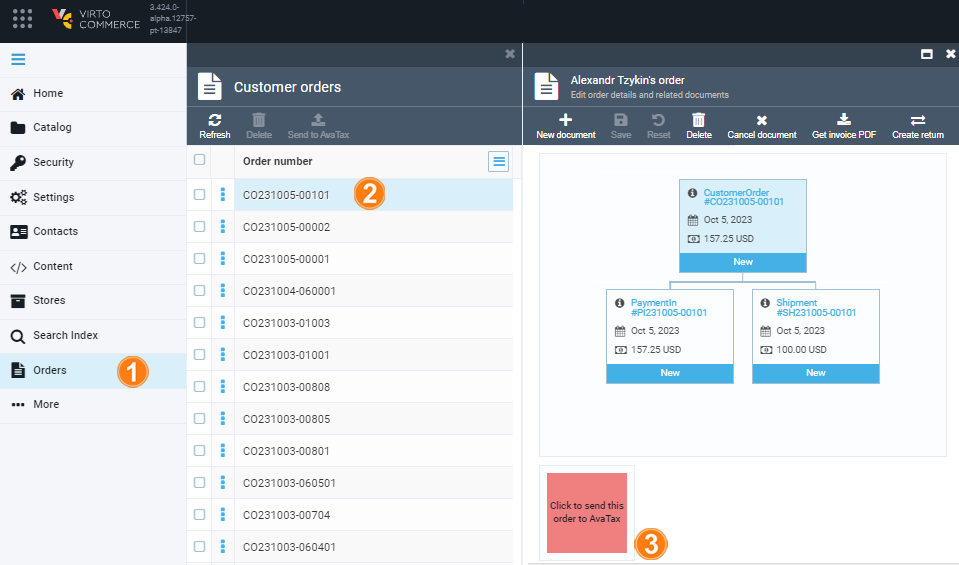

AvaTax automatically calculates sales and use tax for transactions, invoices, and other activity powered by Virto Commerce. Virto Commerce sends transaction data to AvaTax, and AvaTax sends back the tax total. Customers, salespeople, and others can see the tax owed in real time.

## Sending Orders Automatically
To calculate taxes and send them to AvaTax automatically :

1. Go to **Stores** to select your store.

1. Click **Tax providers**.

1. Pick **Avalara Tax Provider**. Make sure the option is switched to **Is active** and go to **Settings**.

1. Enter the desired [settings](settings.md). Enable scheduled synchronization of VC Platform orders with AvaTax to send orders to AvaTax automatically.

1. Verify your connection by pressing **Test connection with AvaTax** button.
    * If the button gets green, the connection was set successfully.
    
    * If the button gets red, correct the listed mistakes.
     

## Sending Orders Manually
In some cases, you may need the option to manually send transaction data to AvaTax. For example, if an error occured during the automatic data transfer. 

To send the data to AvaTax manually:

1. Go to **Orders**.
1. Select the required order.
1. Click the red button to send the order to AvaTax.

