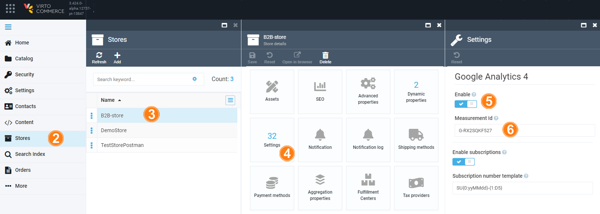

# Integration with Google Analytics 4

[Vue B2B Theme v1.17 2](https://github.com/VirtoCommerce/vc-theme-b2b-vue/releases/tag/1.17.0) and Virto Storefront have native integration with Google Analytics 4 module.

To install it and assign Google Analytics Measurement Id for you store:

1. Create Google Analytics Account according to the [Instruction](https://support.google.com/analytics/answer/9304153)

    
    
1. Go to **Store Settings** > **Settings** to activate **Google Analytics 4** and enter your **Measurement Id**.

    

1. Save the **Store Settings** to activate the Google Analytics tracking.

    
