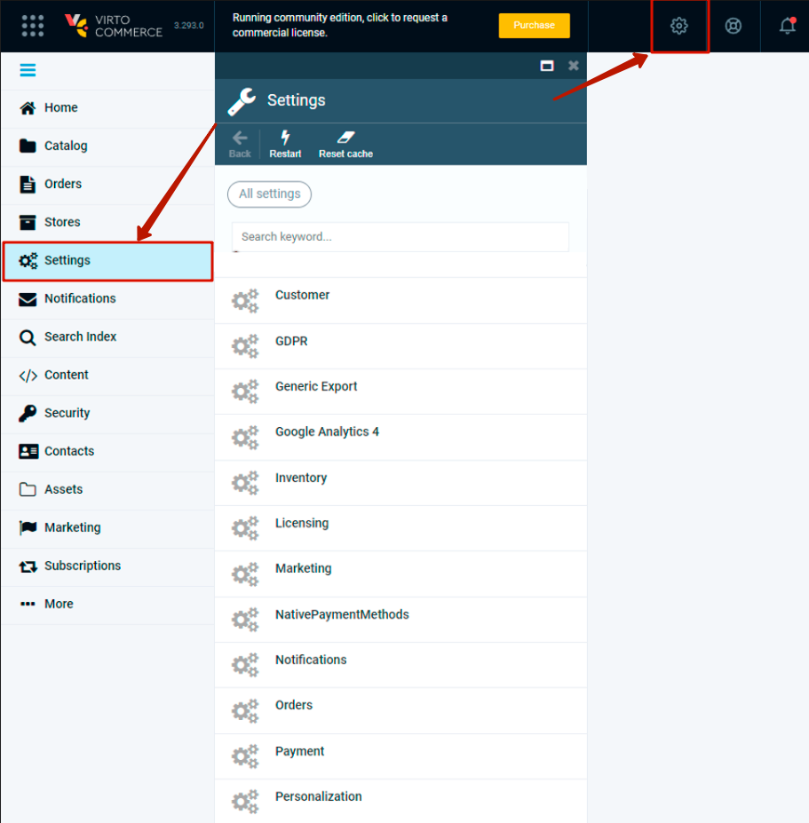
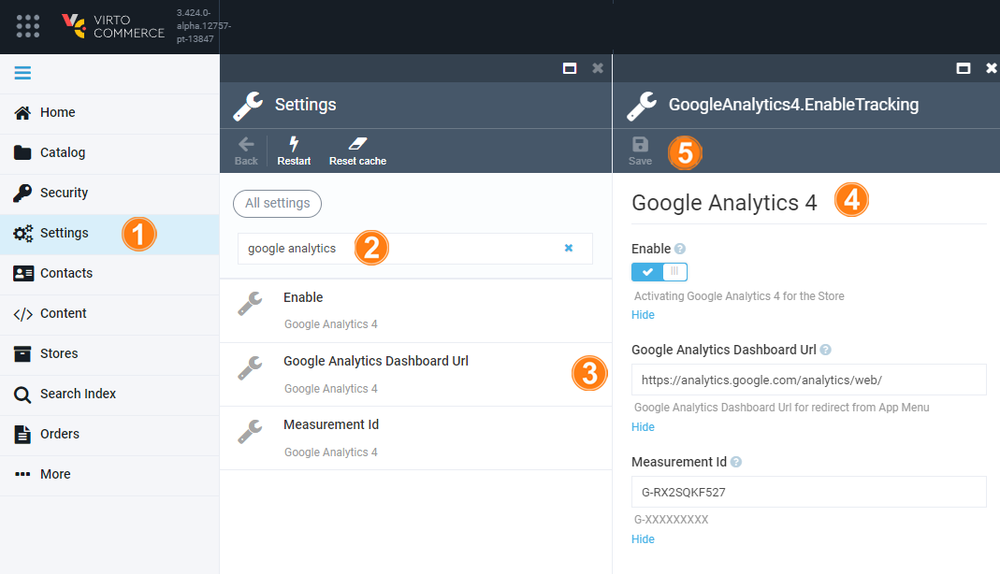

# Google Analytics 4 Settings

To set Google Analytics 4 module:

1. Open **Settings** in either way:

1. Choose **Google Analytics 4**.

1. Fill in the fields as follows:

| Item | Description                                                                                                                                                                                                |
|------|------------------------------------------------------------------------------------------------------------------------------------------------------------------------------------------------------------|
| 1    | Activating Google Analytics 4 for the Store.                                                                                                  |
| 2    | Measurement ID in the format `G-XXXXXXXXX`.                                                                                                                                                                               |
| 3    | Google Analytics Dashboard Url for redirect from App Menu.                                                                                                                                |