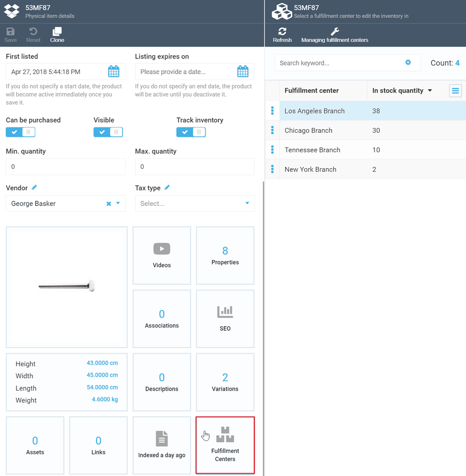
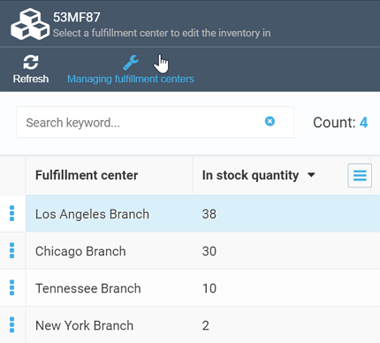

# Fulfillment Centers
Fulfillment centers are processing units involved in receiving, processing, and delivering orders to end customers. Usually, fulfillment in ecommerce includes receiving goods from a supplier, their storage, order processing, and shipping.

## Fulfillment Lifecycle
In Virto Commerce, the fulfillment lifecycle looks as follows:

1. *Shipment created:* As the first step of fulfillment, we create shipment, which may include one or more items in the order. Each order can contain one or more shipments.
2. *Items assigned:* Once the shipment is created, we check whether the items ordered are available; if they are, they get assigned to the relevant shipment.
3. *Released for picking or packaging:* The goods assigned are released for picking or packaging by a customer service representative (CSR).
4. *Packaging:* The goods are packed according to the shipping requirements, e.g., fragile items, special marking, etc.
5. *Shipping:* The packed items are sent to the delivery service for shipping.

## Managing Fulfillment Centers
The Inventory module enables managing multiple fulfillment centers. To access the fulfillment center list, navigate to ***More -> Catalog -> Categories and items -> Item details*** and select the ***Fulfillment centers*** widget:

To view the details of a specific fulfillment center and edit them, or add a new fulfillment center, click ***Managing fulfillment centers***:

Click the fulfillment center which you need to edit the details of to open the following screen:

As the image shows, you can edit fulfillment center description (both long and short) in the HTML/Markdown format, provide location, and edit address.

!!! tip
	To add a new fulfillment center, click the ***Add*** button on the top toolbar. This will open the ***New fulfillment screen***, where you will be able to add the same details as above.
