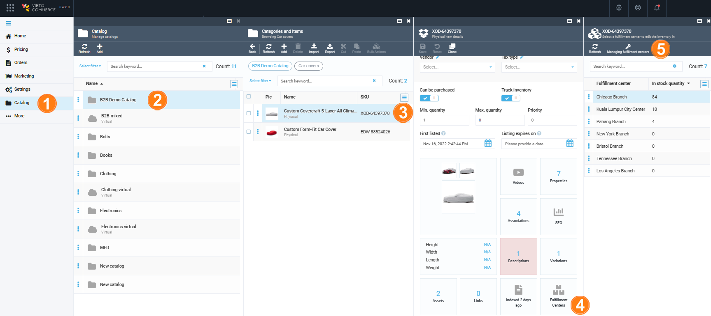

# Manage fulfillment centers

Fulfillment centers are processing units involved in receiving, processing, and delivering orders to end customers. The fulfillment process in e-commerce includes the following steps:

* Receiving goods from a supplier.
* Storing the received goods.
* Processing customer orders.
* Shipping the orders to customers.

To start managing fulfillment centers:

1. Click **Catalog** in the main menu to open the list of catalogs.
1. Select the relevant catalog in the **Catalog** blade.
1. In the next **Categories and Items** blade, select the product.
1. On the product page, click the **Fulfillment centers** widget.
1. In the next blade, click **Managing fulfillment centers** in the toolbar to view the list of fulfillment centers. 

	

Now you can:

* [Add and edit fulfillment centers](managing-fulfillment-centers.md#add-and-edit-fulfillment-center)
* [Delete fulfillment centers](managing-fulfillment-centers.md#delete-fullfillment-center)

## Add and edit fulfillment center

In the list of fulfillment centers:

1. Click the fulfillment center you need to edit or **Add** to add a new one. This opens **Editing fulfillment center** blade.
1. Fill in the following fields
1. Fill in the fields:

	

1. Click **Save** in the toolbar to save the changes.

The modifications have been saved.

## Delete fullfillment center

In the list of fulfillment centers:

1. Click:
	* Three dots to the left of each item in the fullfillment center list and click **Delete** from the popup menu.
	* The fulfillment center you need to delete and then click **Delete** in the new blade.

1. Confirm the deletion. 

The fulfillment center have been permanently removed.