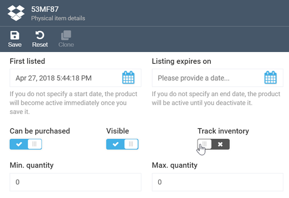

# Working with Inventory Module
 Virto's Inventory module is a store inventory management system, which allows you to track the stock and manage fulfillment centers.

You can access the Inventory module main screen, which is shown below, through the ***Fulfillment Centers*** widget on any physical product page:

The purpose of each field is detailed below:

+ ***In stock:*** The total number of product items available in stock.
+ ***Reserved:*** Number of reserved items.
+ ***Reorder minimum quantity:*** The minimum number of items one can reorder.
+ ***Allow preorder:*** Enables or disables ordering products that are still not in stock. 
+ ***Preorder quantity:*** The number of items that can be preordered.
+ ***Preorder availability date:*** The earliest date the customer may place their preorder. 
+ ***Allow backorder:*** Enables or disables ordering products that are no longer in stock.
+ ***Backorder quantity:*** The number of items that can be backordered.
+ ***Backorder availability date:*** The earliest date the customer may place their backorder. 

!!! tip
	Some products, e.g. custom-made goods, may not require inventory tracking. In this case, you can disable it by switching the respective ***Track Inventory*** toggle off on the relevant product page:
	
	

!!! note
	The Inventory module content can be both exported and imported using the [Export/Import](link-to-export-import) feature.
