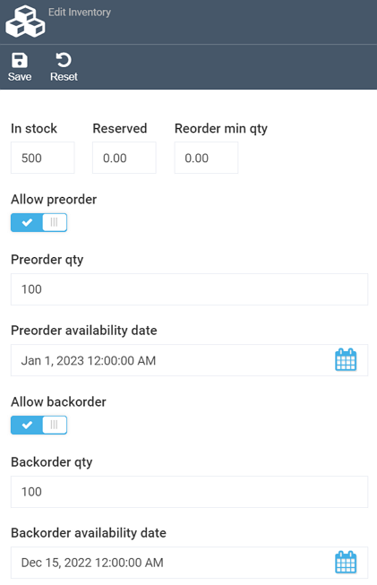

# Adding inventory amount

Virto's Inventory module is a store inventory management system that allows you to track stock and manage fulfillment centers.

To edit a product's inventory:

1. Open the Platform and select the **Catalog** module.
1. Choose the relevant catalog and then select the product.
1. On the product page, click the **Fulfillment centers** widget.
1. Select the fulfillment center to which you want to add product inventory. This action will open the **Edit inventory** blade:

   	

1. Fill in the following fields:

	| Field                           | Description                                                            |
	|---------------------------------|------------------------------------------------------------------------|
	| **In stock**                    | The total number of product items available in stock.                   |
	| **Reserved**                    | The number of reserved items.                                           |
	| **Reorder minimum quantity**    | The minimum number of items that can be reordered.                      |
	| **Allow preorder** switch       | Enables or disables ordering products that are currently not in stock.  |
	| **Preorder quantity**           | The number of items that can be preordered.                             |
	| **Preorder availability date**  | The earliest date on which customers may place their preorders.          |
	| **Allow backorder** switch      | Enables or disables ordering products that are no longer in stock.      |
	| **Backorder quantity**          | The number of items that can be backordered.                            |
	| **Backorder availability date** | The earliest date on which customers may place their backorders.         |

1. Click **Save** to save the changes.

!!! info
	For more information about managing product's availability and tracking inventory for digital and physical products, read [Managing Product Availability](../catalog/setting-product-availability.md).

