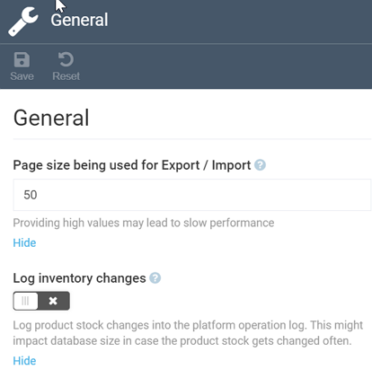
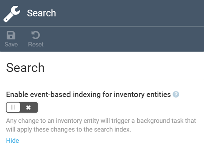

# Inventory Module Settings
The Inventory module settings consist of two small sections:

+ ***General*** settings, which allow you to configure the page size for export or import and enable or disable logging inventory changes:

	

+ ***Search*** settings, which enable or disable event-based indexing:

	
