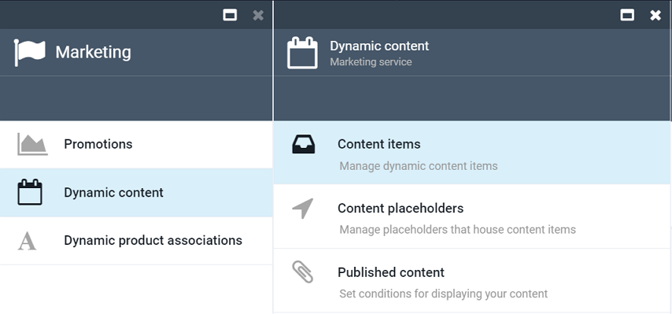
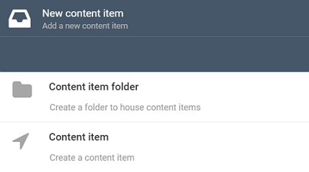
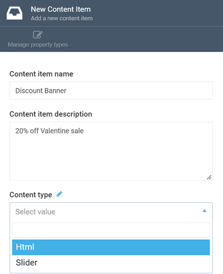
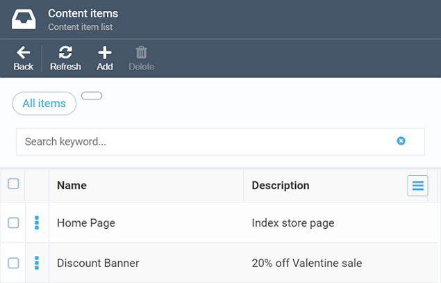
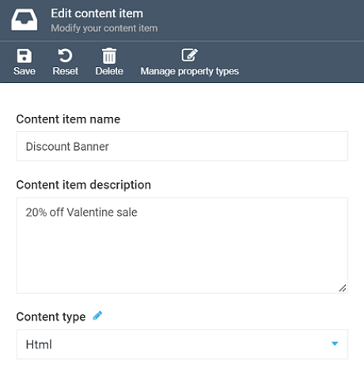
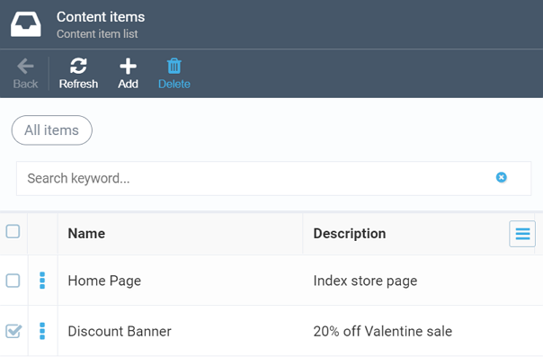

# Managing Dynamic Content Items

This section explains how to manage dynamic content items in Virto Commerce Marketing.

!!! note
	You create ***Dynamic Content*** to specify what kind of content to deliver, e.g., images, flash files, etc., while with [***Published Content***](managing-published-content.md), you determine which dynamic content items should be displayed, and under which conditions.
	
!!! note
	The dynamic content you create may be reused as many times as required through published content items.

!!! warning
	Your dynamic content items will not be available on the front end until they are assigned to a [published content item](managing-published-content.md).

## Creating Content Items

To create a dynamic content item in Virto Commerce Platform Manager, do the following:

+ Open the *Marketing* module and select *Dynamic Content*. The *Dynamic Content* screen will show up, allowing you to select one of the options: *Content items*, *Content placeholders*, or *Published content*. Your choice is *Content items*:

+ The *Content Items* screen will show up and display the existing content items, if there are any. Click the *Add* button on the top of the screen to add your new item.

+ This will open the *New Content Item* screen with two options; you can either create a new content item folder or an individual content item:

!!! note
	Unlike folders, individual content items have one more option that allows you to specify their type:
	
	
	
	You can read more about dynamic content types in [this section](overview.md#dynamic-content) of the overview guide (scroll down to the table).

!!! note
	Content item folders serve as containers for your content items. You can use those to group your content items by their location (e.g., home page, checkout page, etc.), type (e.g. banners), or otherwise, as you find appropriate.

+ Give your folder or content item a name, provide description, and hit *Create*. Once you are done, it will appear on the *Content Items* screen:

## Editing and Deleting Content Items

To edit a content item, open the *Marketing* module, navigate to *Content Items* and select the item you need to edit. After making changes, make sure to save it using the upper toolbar button:

!!! warning
	If you edit the type of a dynamic content item, the relevant properties of such an item will be changed as well.

To delete a content item, select it by ticking the appropriate checkbox and click the *Delete* button:

The system will ask you to confirm the delete, click *Yes*. The item in question will be deleted and removed from the content item list. 

!!! warning
	You can only delete those dynamic content items that do not belong to published content; otherwise, the system will display a message saying the associated published content should be deleted first.