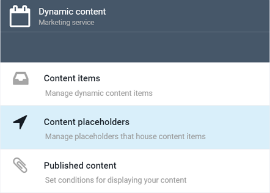
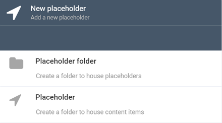
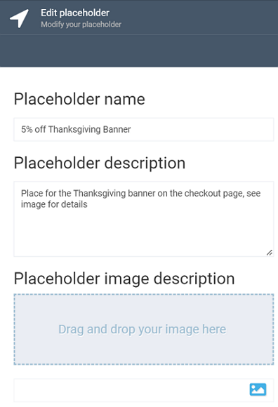
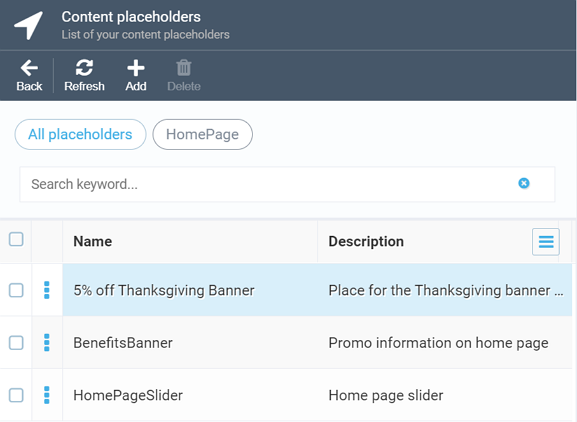

# Managing Content Placeholders

This section explains you how to manage content placeholders in Virto Commerce Marketing.

## Creating New Placeholder

To create a placeholder, do the following:

+ Open the *Marketing* module and select *Dynamic Content*. The *Dynamic Content* will show up, allowing you to select one of the options: *Content items*, *Content placeholders*, or *Published content*. Your choice is *Content placeholders*:

+ The *Content Placeholders* screen will show up and display the existing placeholder items, if there are any. Click the *Add* button on the top of the screen to add your new placeholder.

+ This will open the *New Placeholder* screen with two options; you can either create a new placeholder folder or an individual placeholder:

!!! note
	A placeholder folder is a container for website locations your content items will be displayed at.

!!! note
	Unlike folders, individual placeholders have one more option that allows you to upload an image by clicking the appropriate button:
	
	
	
	This image may help you or your teammates better understand where the content in question will be displayed on your website.

+ Give your folder or placeholder a name, provide description, and hit *Create*. Once you are done, it will appear on the *Content Placeholders* screen:

