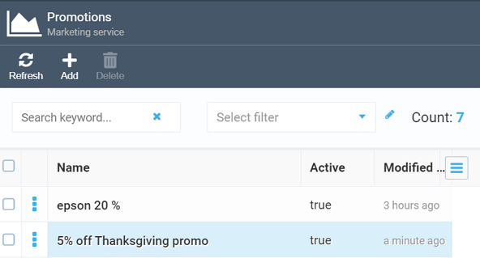
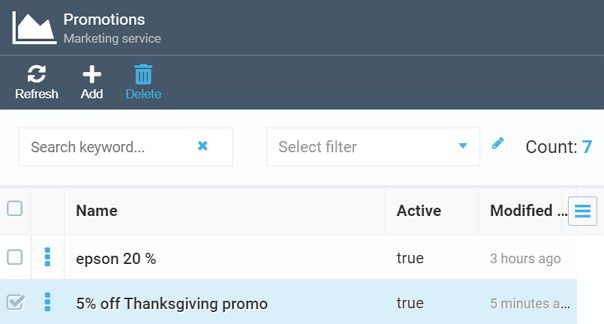

# Managing Promotions

This section explains how to manage promotions in Virto Commerce Marketing.

## Creating New Promotion

!!! Note
	To create a promotion, the user must have the [Manage promotions permission](../security/managing-users.md).

1. Open the **Marketing** module, go to **Promotions** blade.
1. Click **Add** to open the **New Promotion** blade. 
1. Fill in the fields:

	| Field                                      	| Description                                                                                                                                        	|
	|-------------------------------------------	|----------------------------------------------------------------------------------------------------------------------------------------------------	|
	| **Promotion Name**                        	| A descriptive name of your promotion.                                                                                                              	|
	| **Description**                           	| Promotion description (optional).                                                                                                                   	|
	| **Active** switch                         	| Enables or disables your current promotion.                                                                                                        	|
	| **Start date**                            	| First day of the promotion. Without specifying it, the promotion becomes active immediately after being saved.                              	|
	| **Expiration date**                       	| Last day of the promotion. Without specifying it, the promotion remains active until you deactivate it.                                            	|
	| **Exclusivity**                           	| Select an option from a dropdown list: <ul> <li>Valid with other offers.</li> <li>Globally exclusive. Blocks applying other promotions.</li> </ul> 	|
	| **Can be redeemed more than once** switch 	| Enable the option if multiple coupons are required to redeem the offer.                                                                           	|
	| **Stores**                                	| The store your promotion applies to.                                                                                                               	|
	| **Coupons**                               	| [Creating coupons and gift cards](#coupons-and-gift-cards) for the current promotion.                                                                                                  	|

1. Set up promotions conditions.
	1. Select one or several customers groups the promotion is aimed at:
		* **Registered users**.
		* **Everyone**.
		* **First-time customers**.
		* **User group contains**: enter the condition specifying the user group.
	1. Set one or several catalog conditions for the promotion:
		* **Specific category**: select a product category the promotion will be applied to.
		* **Product code contains**: enter product code to define products the promotion will be applied to.
		* **Currency**: select currency from a dropdown list.
		* **Specific product**: select a product from catalog to apply promotion to.
		* **In stock quantity**: enter the required amount of product.
		* **Apply only to full price items and not sales items**.
	1. Set one or more cart conditions for the promotion:
		* **Number of items in the shopping cart**.
		* **Number of items out of a category in the shopping cart**.
		* **Number of specific product items in the shopping cart**.
		* **Cart subtotal is**.  

	[Read more about promotion conditions](promotion-rules.md){ .md-button }.

1. Click **Create**. Your newly created promotion appears in the promotions list:

	

### Coupons and gift cards

As of [VC Marketing module version 3.210.0](https://github.com/VirtoCommerce/vc-module-marketing/releases/tag/3.210.0), creating personal coupons is possible. 

To create a coupon:

1. Open the **Marketing** module, go to **Promotions** blade.
1. Select a promotion you want to create coupons or gift cards for.
1. In the new blade, click on the **Coupons** widget. 
1. Click **Add** or **Import** coupons in the **Coupons** blade.

=== "Add coupon"

	1. Fill in the fields:

		| Field                      	| Description                                                                                                                                                                       	|
		|----------------------------	|-----------------------------------------------------------------------------------------------------------------------------------------------------------------------------------	|
		| Code                       	| Specify a coupon code using only alphanumeric characters.                                                                                                                         	|
		| Coupon expiration date     	| Leave this field blank in case it is the same as the promotion expiration date.                                                                                                   	|
		| Maximum use number         	| Specify how many times this coupon may be redeemed. If you do not want to set any limit, put 0.                                                                                   	|
		| Maximum uses per customer  	| Specify how many times this coupon may be redeemed by a single user. If you do not want to set any limit, put 0.                                                                  	|
		| Customer                   	| Select a customer or organization from a dropdown list. Only the specified person or organization will be able to use to coupon. This feature allows issuing personal gift cards. 	|

	1. Click **Save**.

=== "Import coupon from CSV file"

	1. Fill in the fields.

		| Field                	| Description                                                                                                        	|
		|----------------------	|--------------------------------------------------------------------------------------------------------------------	|
		| CSV column delimiter 	| Select a delimiter from a dropdown list: <ul> <li>Space.</li> <li>Comma.</li> <li>Semicolon.</li> <li>Tab.</li>  </ul> 	|
		| Expiration date      	| Leave this field blank in case it is the same as the promotion expiration date.                                    	|

	1. Upload CSV file.
	1. Click **Start import**.

## Editing and deleting promotions

To edit a promotion:

1. Open the **Marketing** module.
1. Go to **Promotions** and select the promotion you need to edit. 
1. Click **Save** to save the changes.

To delete a promotion:

1. Open the **Marketing** module.
1. Go to **Promotions** and tick the promotion in the promotions list. 
1. Click **Delete**:

	

1. Click **Yes** to confirm deleting. The promotion will be removed from the promotions list.