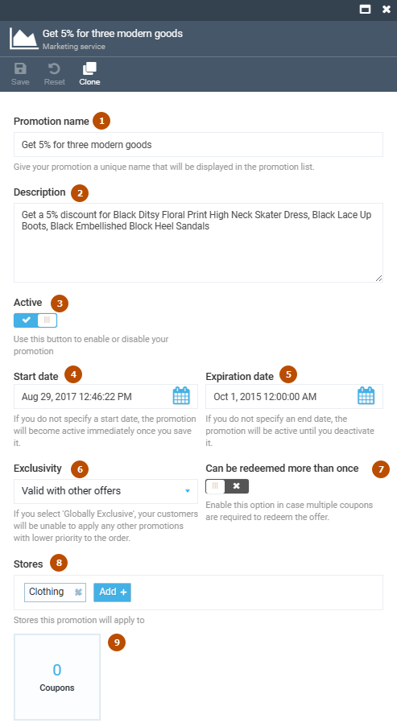
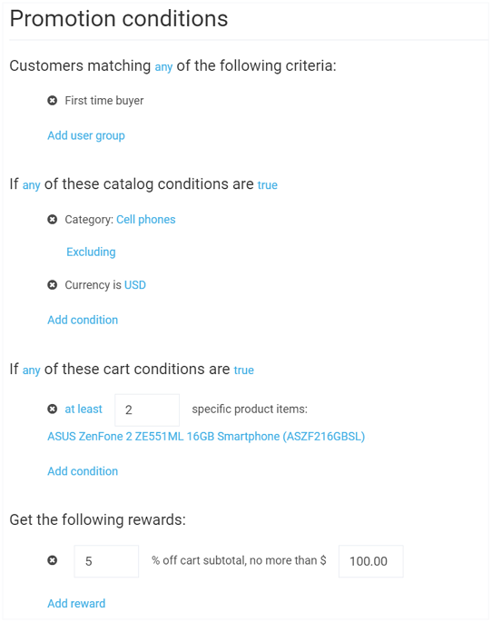

# Managing Promotions

This section will explain you how to manage promotions in Virto Commerce Marketing.

## Creating New Promotion

!!! warning
	To create a promotion, you must have the ***Manage promotions*** permission.

+ Open the *Marketing* module, navigate to *Promotions* tab and click Add. This will open the *New Promotion* screen:

+ Set up the promotion properties (see [below](#promotion-properties) for more information) and click *Create*. Your newly created promotion will show up in the promotion list:

### Promotion Properties
Each promotion you create has the following configurable properties:

+ Promotion Name: The name you give to your promotion. This should be as meaningful as possible for the later search purposes.
+ Description: Promotion description (not required).
+ Store: The store your promotion applies to.
+ Start Date: The date your promotion is available from. If you do not specify a start date, the promotion will become active immediately once you save it.
+ Expiration Date: The date your promotion becomes unavailable. If you do not specify an end date, the promotion will be active until you deactivate it.
+ Promotion Conditions: The rules or conditions under which the promotion will be applied.

!!! tip
	You can read more about promotion conditions [here](promotion-rules.md).

## Editing and Deleting Promotions

To edit a promotion, open the *Marketing* module, navigate to *Promotions* and select the promotion you need to edit. After making changes, make sure to save it using the upper toolbar button.

To delete a promotion, select it by ticking the appropriate checkbox and click the *Delete* button:

The system will ask you to confirm the delete, click *Yes*. The promotion in question will be deleted and removed from the promotion list.