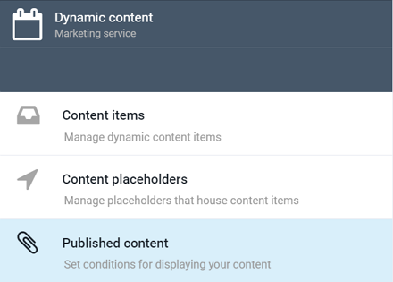
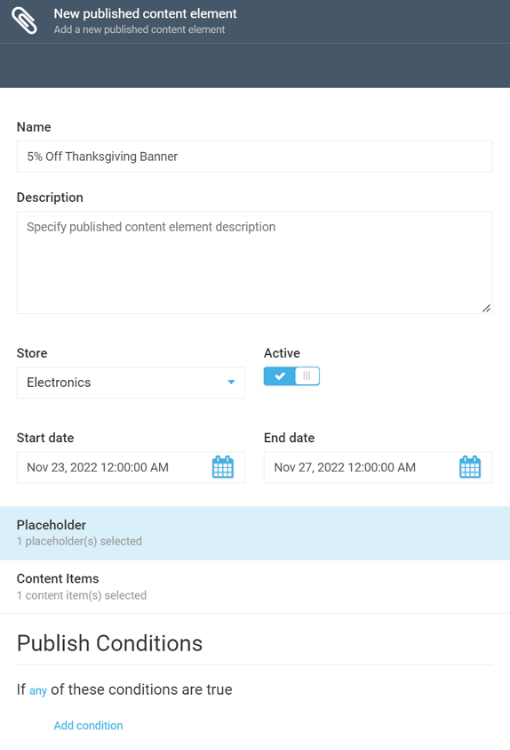
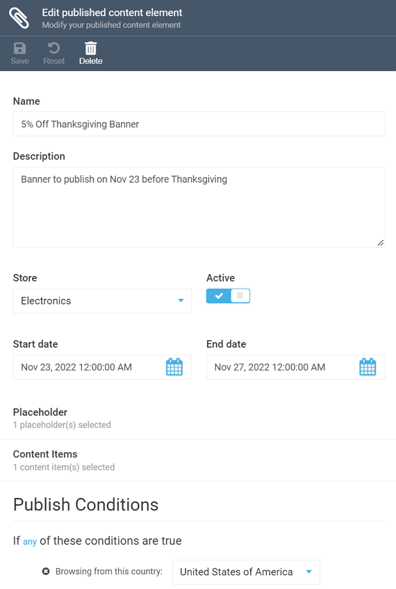
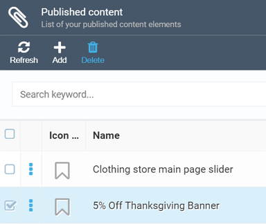

# Managing Published Content

As the name suggests, the published content feature determines the conditions, under which your content will be published or displayed on your website or online store. This means, after creating your marketing [content items](managing-content-items.md), be it banners, sliders, or otherwise, and setting their locations on your website ([placeholders](managing-content-placeholders.md)), your next step is configuring published content, so that your banners or sliders may finally come online.

## Adding Published Content

To add a published content item, you need to do the following:

+ Open the *Marketing* module and select *Dynamic Content*. The *Dynamic Content* screen will show up, allowing you to select one of the options: *Content items*, *Content placeholders*, or *Published content*. Your choice here is *Published content*:

+ The *Published Content* screen will show up and display the existing items, if there are any. Click the *Add* button on the top of the screen to add new published content.

+ This will open the *New Published Content Element* screen, where you can give your new item a name and description, provide dates between which the content will be displayed, specify the stores it will apply to, and add the appropriate content items and their placeholders:

!!! note
	Each published content item may be configured for a single store only. If you need the same item for multiple stores, you will have to recreate your published content item for each store.

This screen also allows you to configure publish conditions, which we specifically cover [here](publish-conditions.md).

## Editing and Deleting Published Content

To edit a published content item, open the *Marketing* module, navigate to *Published Content* and select the item you need to edit. After making changes, make sure to save it using the upper toolbar button:

To delete a content item, select it by ticking the appropriate checkbox and click the *Delete* button:

The system will ask you to confirm the delete, click *Yes*. The item in question will be deleted and removed from the published content item list.

