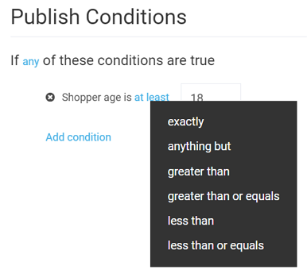

# Publish Conditions 

Virto's Marketing module allows you to precisely customize publishing conditions for your marketing content. With various expressions and operators, you can adapt your content behavior to virtually any situation when it comes to your promotions and marketing campaigns.

The first line of the *Publish Conditions* section determines whether any condition you provide will trigger the system to display your content. Alternatively, you can click the *any* word to switch it to *all*; in this case, the content will be displayed only if all conditions you list are met.

The second line is actually a clickable UI element saying *Add condition*. You can add any reasonable number of conditions you need. Once you click this button, you will be prompted to select one of the four options:

+ Location: Defines the location of your website visitors. You can configure the content to be displayed for users that visit your store from a specific country, state or province, city, or even time zone.
+ Browsing behavior: Here, you can target your website visitors that searched for something specific or have a specific user language set in their browser.
+ Customer profile: Includes the visitor's age and gender.
+ Catalog options: Allows you to speficy products or categories the content will apply to.

In addition to that, you can also customize the expressions to cover various targeting options, where possible. For instance, you can configure the customer age to be exactly 18 years old, greater than 18, less than 18, anything but 18, etc.:

As you can see, the customizability options are virtually limitless and may come in handy for a great number of promotions and campaigns. For instance, the conditions below are configured in such a way that the content will be displayed only to male customers older than 18 residing in Ohio who searched for anything containing *phone* in the *Cell phones* category:

 