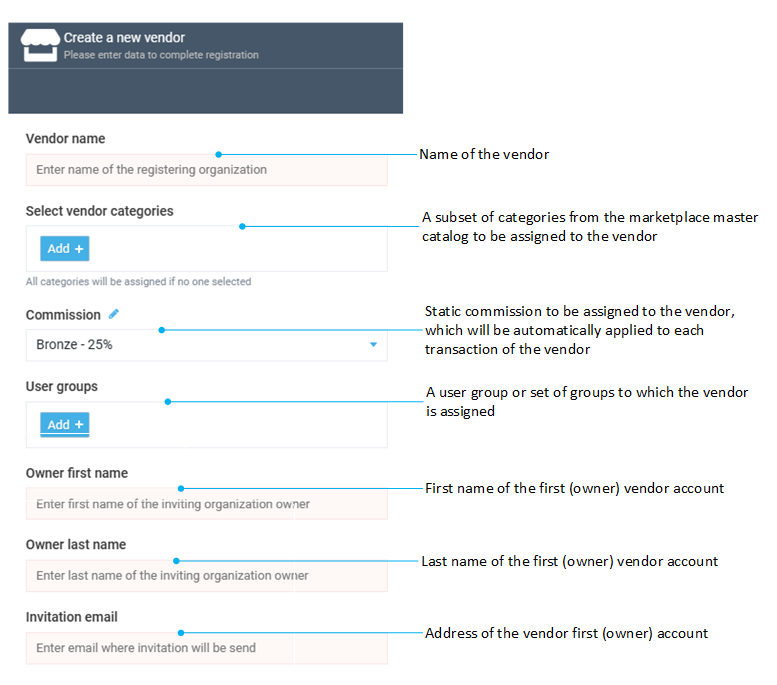

# Vendor onboarding

Vendors are the key entities in every marketplace. That’s why it is crucial for the operator to have an extensive and user friendly way of managing them.

## Onboard new vendor

The type and amount of information that needs to be collected from a vendor is unique to each marketplace project. To onboard a new vendor, the marketplace operator must collect all the necessary vendor information.

Once the vendor data has been collected, the vendor can be onboarded to the marketplace. Adding a new vendor to Virto is very simple. An operator needs to configure all the vendor related data and set up the first (Owner's) account of the vendor. The account owner will receive an invitation email at the provided address with the activation link.

Once the owner's account is activated, it's ready to start using the marketplace.

## Add new vendor

To add a new vendor:

1. Click **Vendors** in the main menu to open the list of vendors.

1. In the next blade, click **Add** in the toolbar.

1. In the new blade, fill in the following fields:

    

1. Click **Invite** to send an invitation.

As a result, a new Vendor entity will be added to the list and the vendor owner will receive an email with an account activation link. Once the account is activated, the owner will be able to start using the Vendor portal and work with the Marketplace.
