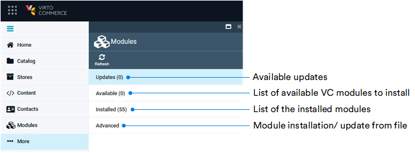
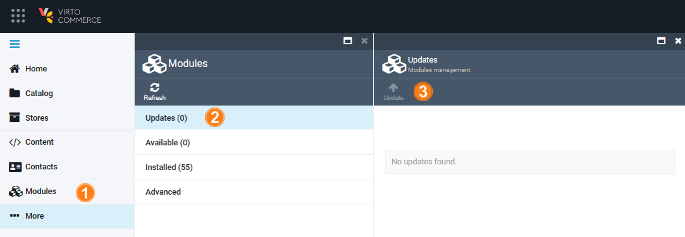
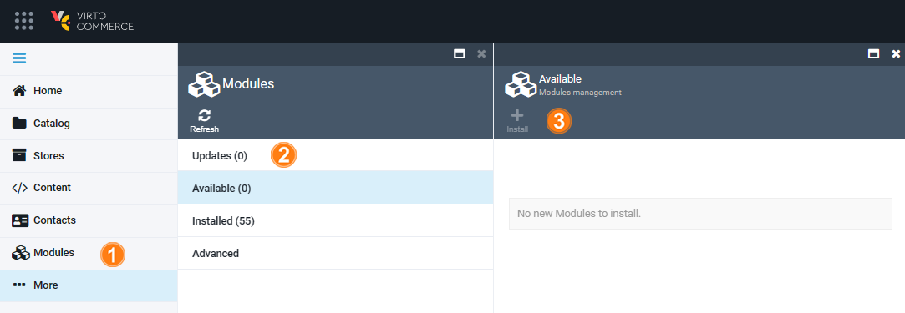
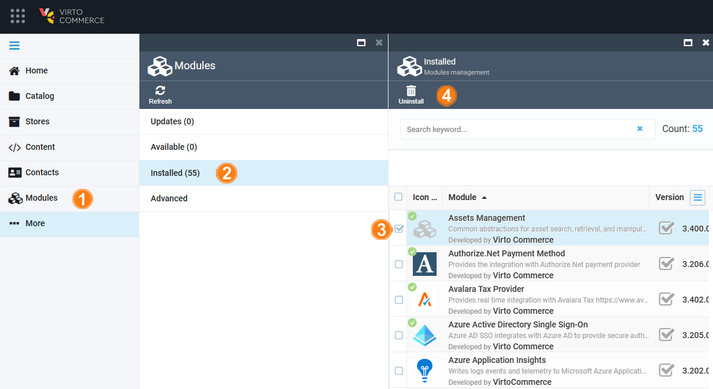
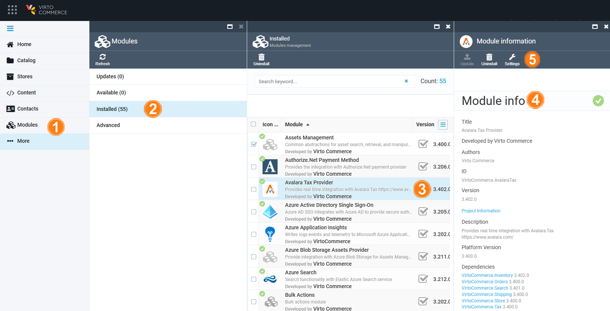
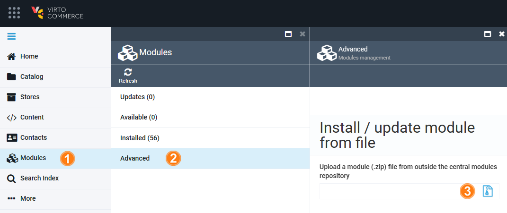

# Modules Installation

The Modules can be accessed only by admin user who can view the installed modules, new updates, install new modules or remove the installed ones.

Clicking the **Modules** in the main menu opens the **Modules** blade:

## Update Modules

To update modules:

1. Click **Modules** in the main menu.
1. In the **Modules** blade, select **Updates**.
1. Click **Update** in the toolbar.

Your modules have been successfully updated.

## Install Modules

To install modules automatically:

1. Click **Modules** in the main menu.
1. In the **Modules** blade, select **Available**.
1. Select available modules to install and click **Update** in the toolbar.

Your modules have been successfully installed.

## Uninstall Modules

!!! info
    All the Virto Commerce modules are marked with {: width="25"}.

To uninstall the list of the installed modules:

1. Click **Modules** in the main menu.
1. In the **Modules** blade, select **Installed**.
1. Check the modules to uninstall.
1. Click **Uninstall** in the toolbar.

The selected modules have been uninstalled.

## View Modules Info

To view the module info:

1. Click **Modules** in the main menu.
1. In the **Modules** blade, select **Installed**.
1. Select a module from the list.
1. View module info including its authors and version.
1. View the module setting. For more information about each module's settings, see the corresponding article in each module description section.

## Install/ Update Module from File

To install/ update module from file:

1. Click **Modules** in the main menu.
1. In the **Modules** blade, select **Advanced**.
1. Upload a module .zip file from outside the central modules repository.

The installation (update) starts automatically.
