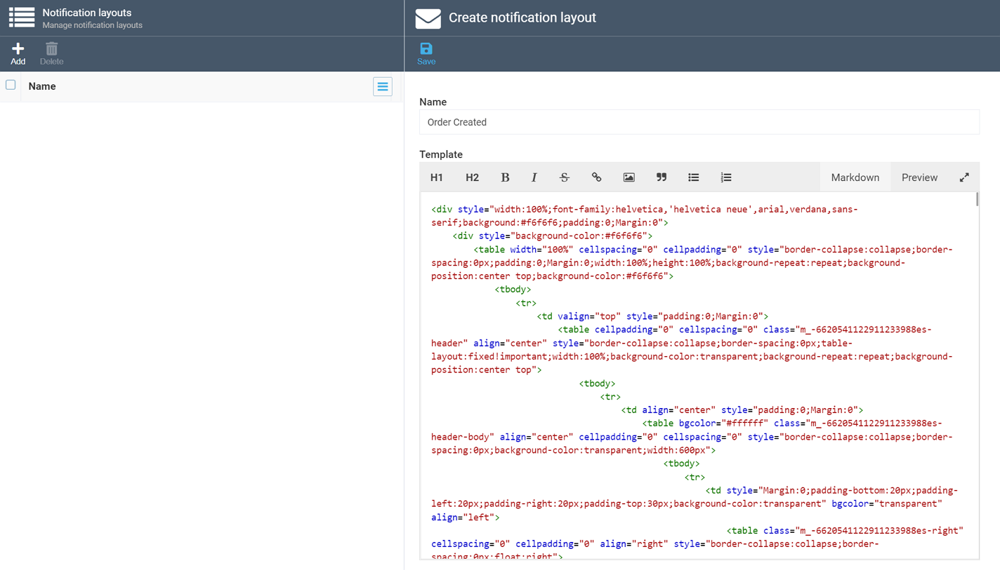
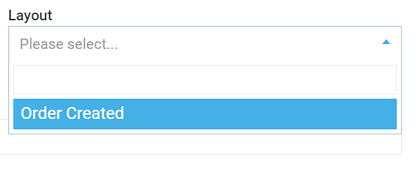

# Notification Layouts
The ***Notification layout*** option allows you to manage the existing layouts and add new ones. Layouts define formatting for your [notification templates](notification-templates.md) and use mostly HTML and CSS languages, which means you may require help from your web designers to configure those.

To create a new notification layout, click the ***Add*** button, paste or write your layout, and click ***Save***: 

Once you do so, your new layout will be available for picking in the ***Layout*** list within the [Notification template](notification-templates.md) screen:

