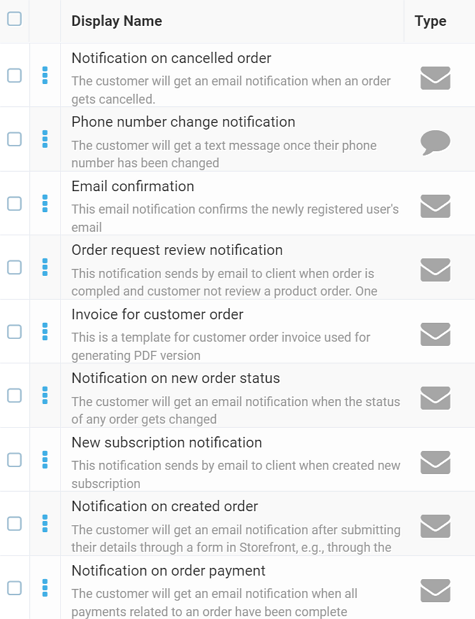
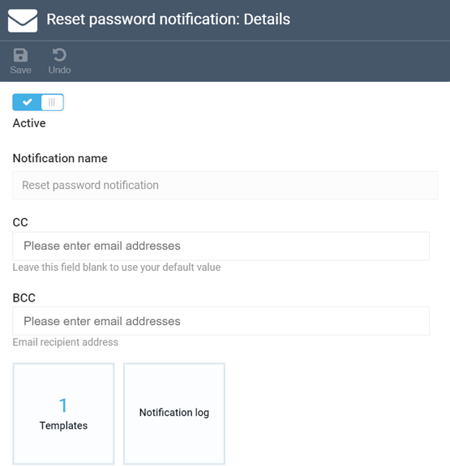
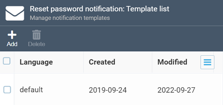

# Notification List

The notification list shows all existing notifications that are currently configured for your store. This includes all our out-of-the-box notifications, as well as your custom ones, if any. The icon to the right (**Type**) shows whether this is an email (mailbox icon) or a text message (message icon) notification:

## Notification Details
Once you click any notification in the list, the ***Notification Details*** screen will show up:

While the *Notification name* field is uneditable, you can provide emails for the ***CC*** and ***BCC*** fields and toggle the ***Active*** button, which activates or disables your notification.

Apart from those fields, you also have two widgets to manage your notifications, which we will cover below.

### Widgets

The first widget, ***Templates***, shows the list of templates for your notification:

Templates are, basically, containers that house all content for your notification, i.e. the message you are sending to your customer. For each template, you can set language, assign specific layout<!---add link to notif layouts-->, and provide the subject line and the message itself:

<!---add image-->

As you can see, you can format your message with both HTML and Markdown, and then click ***Preview*** to see how it will roughly look like:

<!---add image-->

Finally, you can provide sample JSON data to replace the variables with specific values in the preview:

<!---add image-->

The ***Notification log*** widget is pretty simple and shows whether the notification was delivered successfully or failed when it was being sent:

<!---add image-->